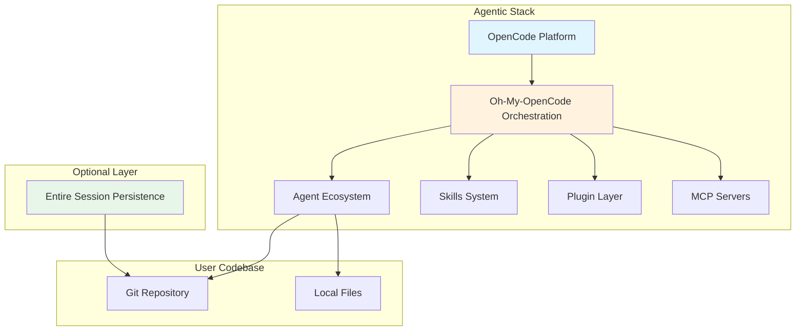
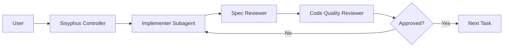
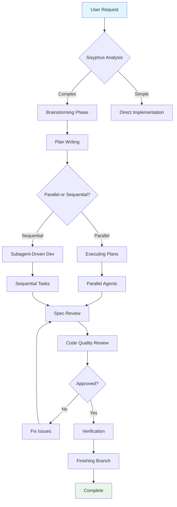
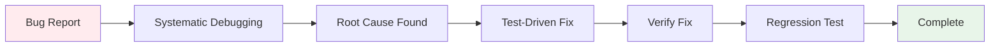
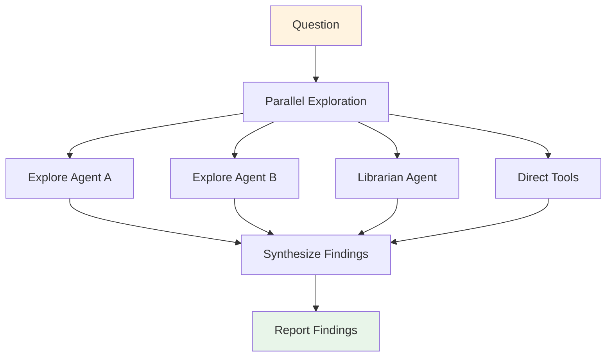
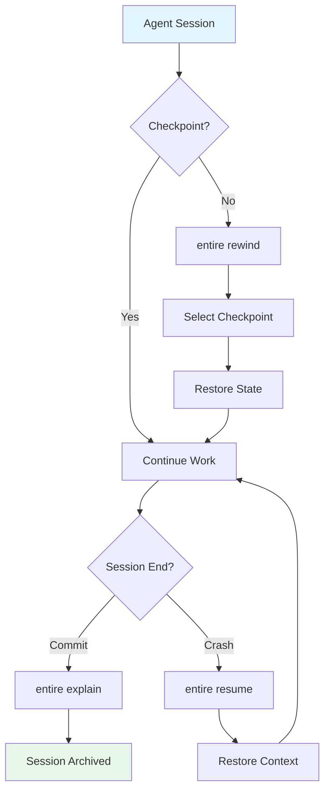

# Harness: Agentic Development Stack

**Version:** 1.3  
**Last Updated:** February 14, 2026  
**Stack:** OpenCode + Oh-My-OpenCode + Skills + Plugins + MCP + Entire  
**Target Audience:** Engineers onboarding to agentic workflows

---

## Executive Summary

This document provides a comprehensive guide to the agentic development workflow stack used across our projects. It covers the architecture, configuration, tradeoffs, and best practices for leveraging AI agents effectively in software development.

The stack consists of:
- **[OpenCode](https://github.com/sst/opencode)**: The base agent platform ([⭐ 101k](https://github.com/sst/opencode))
- **[Oh-My-OpenCode](https://github.com/code-yeongyu/oh-my-opencode)**: Agent orchestration framework ([⭐ 31k](https://github.com/code-yeongyu/oh-my-opencode))
- **112+ Skills**: Reusable expertise modules (60 Claude, 21 OpenCode, 31 [Superpowers](https://github.com/obra/superpowers))
- **7 Plugins**: Enabled integrations (4 recently disabled as redundant)
- **1 MCP**: Memory persistence via [claude-mem](https://github.com/thedotmack/claude-mem) ([⭐ 27k](https://github.com/thedotmack/claude-mem))
- **[Entire](https://github.com/entireio/cli)**: Session persistence and checkpoint recovery (optional, recommended) ([⭐ 2.2k](https://github.com/entireio/cli))

### ✅ Global Infrastructure (Recently Implemented)

The following global infrastructure has been implemented to support all projects:

| Component | Status | Purpose |
|-----------|--------|---------|
| **Cost Tracking** | ✅ Active | API usage and cost monitoring across all projects |
| **CI/CD Templates** | ✅ Ready | Reusable GitHub Actions workflows |
| **CLI Tools** | ✅ Installed | act, localstack, gh, gitleaks, eslint, prettier |
| **Knowledge Base** | ✅ Created | Centralized documentation structure |
| **Crontab Jobs** | ✅ Scheduled | Automated maintenance (cleanup, analytics, reports) |
| **Project Setup Script** | ✅ Available | One-command project initialization |

---

## Table of Contents

1. [Architecture Overview](#1-architecture-overview)
2. [Core Components](#2-core-components)
3. [Agent Ecosystem](#3-agent-ecosystem)
4. [Skills Library](#4-skills-library)
5. [Configuration Deep Dive](#5-configuration-deep-dive)
6. [Token Usage & Optimization](#6-token-usage--optimization)
7. [Session Compaction & New Sessions](#7-session-compaction--new-sessions)
8. [Areas of Concern in Agentic Workflows](#8-areas-of-concern-in-agentic-workflows)
9. [Tools & Solutions by Concern](#9-tools--solutions-by-concern)
10. [Ideal Workflows](#10-ideal-workflows)
11. [Onboarding Guide](#11-onboarding-guide)
12. [Troubleshooting](#12-troubleshooting)

---

## 1. Architecture Overview



### Key Architectural Principles

1. **Separation of Concerns**: Each layer handles distinct responsibilities
2. **Skill-First Approach**: Process guidance encoded in reusable skills
3. **Agent Orchestration**: Specialized agents for different tasks
4. **Context Management**: Multiple strategies (MCP memory, session persistence)
5. **Git-Centric**: All workflows centered on git operations

---

## 2. Core Components

### 2.1 OpenCode Platform
**Role:** Base execution environment for AI agents
**GitHub:** [github.com/sst/opencode](https://github.com/sst/opencode) ⭐ 101k

**Capabilities:**
- LSP integration (diagnostics, goto definition, references)
- AST-aware code manipulation
- File system operations
- Bash execution
- Web search and fetch
- Git operations

**Configuration:** `~/.config/opencode/opencode.json`
```json
{
  "apiKey": "${OPENCODE_API_KEY}",
  "model": "zai-coding-plan/glm-4.7",
  "maxTokens": 8000,
  "temperature": 0.7
}
```

### 2.2 Oh-My-OpenCode
**Role:** Agent orchestration framework
**GitHub:** [github.com/code-yeongyu/oh-my-opencode](https://github.com/code-yeongyu/oh-my-opencode) ⭐ 31k

**Purpose:** Defines which agents exist, which models they use, and how they coordinate

**Configuration:** `~/.config/opencode/oh-my-opencode.json`

```json
{
  "agents": {
    "sisyphus": { "model": "zai-coding-plan/glm-4.7" },
    "librarian": { "model": "zai-coding-plan/glm-4.6" },
    "explore": { "model": "xai/grok-4-1-fast" },
    "oracle": { "model": "zai-coding-plan/glm-5" },
    "frontend-ui-ux-engineer": { "model": "google/gemini-3-flash" },
    "document-writer": { "model": "google/gemini-3-flash" },
    "multimodal-looker": { "model": "google/gemini-3-flash" }
  },
  "background_task": {
    "defaultConcurrency": 3,
    "providerConcurrency": {
      "anthropic": 2,
      "openai": 5,
      "google": 5
    },
    "modelConcurrency": {
      "zai-coding-plan/glm-4.7": 3,
      "google/gemini-3-flash": 5
    },
    "staleTimeoutMs": 180000
  }
}
```

**Key Insight:** Different agents use different models optimized for their task:
- **sisyphus/oracle**: Most capable models (glm-4.7, glm-5) for complex reasoning
- **explore**: Fast model (grok-4-1-fast) for parallel codebase exploration
- **frontend/document/multimodal**: Efficient models (gemini-3-flash) for routine tasks

---

## 3. Agent Ecosystem

### 3.1 Primary Agents

| Agent | Model | Purpose | When to Use |
|-------|-------|---------|-------------|
| **sisyphus** | glm-4.7 | Main orchestrator | Default entry point for most tasks |
| **librarian** | glm-4.6 | External research | Finding docs, examples, best practices |
| **explore** | grok-4-1-fast | Codebase exploration | Parallel grep, pattern finding |
| **oracle** | glm-5 | Complex reasoning | Architecture decisions, debugging |
| **frontend-ui-ux-engineer** | gemini-3-flash | UI/UX implementation | Frontend components, styling |
| **document-writer** | gemini-3-flash | Documentation | Creating docs, READMEs |
| **multimodal-looker** | gemini-3-flash | Visual analysis | Image interpretation, diagrams |

### 3.2 Agent Coordination Patterns

**Pattern 1: Direct Delegation**
```
User Request → Sisyphus → Task Analysis → Delegate to Specialist Agent → Result
```

**Pattern 2: Parallel Exploration**
```
User Request → Sisyphus
    ├─► Explore Agent A (codebase patterns)
    ├─► Explore Agent B (implementation examples)
    ├─► Librarian Agent (external docs)
    └─► Direct Tools (grep, LSP)
```

**Pattern 3: Hierarchical Review**
```
Implementation → Self-Review → Spec Review → Code Quality Review → Final Review
```

### 3.3 Subagent-Driven Development

A specialized workflow where subagents handle implementation with two-stage review:



**Key Rules:**
1. Fresh subagent per task (no context pollution)
2. Two-stage review mandatory (spec compliance → code quality)
3. Review loops until approved
4. Controller extracts all tasks upfront

---

## 4. Skills Library

### 4.1 Skill Organization

Skills are organized in three layers:

```
~/.claude/skills/           # Domain expertise (60 files)
├── coding-standards.md
├── frontend-patterns.md
├── backend-patterns.md
├── security-review/
├── tdd-workflow/
└── ...

~/.config/opencode/skill/   # Project-specific (21 files)
├── systematic-debugging/
├── prompt-engineering-patterns/
├── frontend-design/
└── ...

~/.config/opencode/superpowers/skills/  # Workflow patterns (31 files, ~3K lines) - [Superpowers](https://github.com/obra/superpowers) ⭐ 50k
├── using-superpowers/
├── test-driven-development/
├── systematic-debugging/
├── subagent-driven-development/
├── brainstorming/
├── writing-plans/
├── executing-plans/
├── verification-before-completion/
└── ...
```

### 4.2 Skill Types

**Rigid Skills** (must follow exactly):
- `test-driven-development` - TDD discipline
- `systematic-debugging` - Root cause analysis
- `subagent-driven-development` - Implementation workflow

**Flexible Skills** (adapt principles):
- `coding-standards` - Adapt to project conventions
- `frontend-patterns` - Choose appropriate patterns
- `prompt-engineering-patterns` - Customize prompts

### 4.3 Critical Skills

| Skill | Purpose | Lines | Tokens |
|-------|---------|-------|--------|
| **using-superpowers** | Skill invocation bootstrap | 88 | ~130 |
| **coding-standards** | TS/JS/React best practices | 521 | ~780 |
| **test-driven-development** | TDD workflow enforcement | ~300 | ~450 |
| **systematic-debugging** | Root cause investigation | ~300 | ~450 |
| **writing-plans** | Planning discipline | ~400 | ~600 |
| **executing-plans** | Parallel execution | ~300 | ~450 |
| **subagent-driven-development** | Implementation workflow | 241 | ~360 |

### 4.4 Skill Invocation Rule

**Golden Rule:** If there's even a 1% chance a skill applies, invoke it.

```
User Message Received
    ↓
Might any skill apply?
    ├─ Yes (even 1%) → Invoke Skill tool → Follow skill
    └─ No → Respond directly
```

**Anti-patterns to avoid:**
- "This is just a simple question" → Skills tell HOW to answer
- "I need more context first" → Skills provide HOW to gather context
- "I remember this skill" → Skills evolve, read current version

---

## 5. Configuration Deep Dive

### 5.1 AGENTS.md

**Location:** `~/.config/opencode/AGENTS.md`  
**Lines:** 135 (after cleanup)  
**Purpose:** Universal workflow rules for all agents

**Key Sections:**
1. Language & Communication (English only)
2. Package Management (uv for Python, bun for JS/TS)
3. Git Workflow (worktrees, feature branches)
4. Task Planning (read .sisyphus/, phased approach)
5. Version Control (commit per todo, 65% warn / 70% cutoff)
6. Error Handling → Refers to coding-standards.md
7. Security & Safety → Refers to security-review skill
8. Quality Assurance → Refers to TDD skill
9. Communication Protocols
10. Performance Optimization
11. Learning & Improvement
12. Collaboration Guidelines
13. Stop Conditions & Escalation
14. Tool Usage Guidelines
15. Verification Evidence

**Note:** Sections 6-8 now refer to skills instead of inline rules (saves ~140 tokens/session).

### 5.2 Plugin Configuration

**Location:** `~/.claude/settings.json`

**Current State (7 enabled, 4 disabled):**
```json
{
  "enabledPlugins": {
    "commit-commands@claude-code-plugins": true,
    "context-management@claude-code-workflows": true,
    "playground@claude-plugins-official": true,
    "handbook-git-worktree@cc-handbook": true,
    "agent-sdk-dev@claude-code-plugins": true,
    "ralph-wiggum@claude-code-plugins": true,
    "feature-dev@claude-code-plugins": true,
    "learning-output-style@claude-code-plugins": true,
    "hookify@claude-code-plugins": true,
    
    // Disabled (use skills instead):
    "pr-review-toolkit@claude-code-plugins": false,
    "code-review@claude-code-plugins": false,
    "frontend-design@claude-code-plugins": false,
    "security-guidance@claude-code-plugins": false
  }
}
```

**Rationale for Disables:**
- `pr-review-toolkit` → Use `requesting-code-review` skill
- `code-review` → Use `receiving-code-review` skill
- `frontend-design` → Use `frontend-patterns.md` skill
- `security-guidance` → Use `security-review` skill

### 5.3 MCP Servers

**Location:** `~/.claude/settings.json`

**Active:**
- **claude-mem**: [github.com/thedotmack/claude-mem](https://github.com/thedotmack/claude-mem) ⭐ 27k
```json
{
  "mcpServers": {
    "claude-mem": {
      "type": "stdio",
      "command": "bun",
      "args": [
        "/Users/calebrosario/.claude-mem-install/plugin/scripts/worker-service.cjs",
        "start"
      ],
      "cwd": "/Users/calebrosario/.claude-mem-install"
    }
  }
}
```

**Purpose:** Persistent memory/context across sessions

**Limitations:**
- In-memory queryable context (cross-session)
- Not git-linked or commit-aware
- Complements (doesn't replace) Entire's session storage

### 5.4 CI/CD & Local Development Tools

**Status:** ✅ **Installed & Active**

The following tools are installed and used for local development and CI/CD testing:

| Tool | Purpose | GitHub | Status |
|------|---------|--------|--------|
| **act** | Local GitHub Actions testing | [nektos/act](https://github.com/nektos/act) ⭐ 54k | ✅ Installed |
| **localstack** | Local AWS services emulation | [localstack/localstack](https://github.com/localstack/localstack) ⭐ 55k | ✅ Installed |
| **gh** | GitHub CLI for PR/Issue management | [cli/cli](https://github.com/cli/cli) ⭐ 37k | ✅ Installed |

#### Act (GitHub Actions Local Runner)

**Purpose:** Test GitHub Actions workflows locally before pushing to avoid broken CI/CD pipelines.

**Common Commands:**
```bash
# Test entire workflow
act

# Test specific job
act -j test

# Test with PR event
act pull_request

# Test with secrets file
act --secret-file .secrets

# List available jobs
act -l
```

**Use Cases:**
- Validate workflow syntax before committing
- Test CI changes without pushing to GitHub
- Debug failing workflows locally
- Speed up CI/CD development cycle

#### LocalStack (AWS Local Emulation)

**Purpose:** Develop and test AWS integrations locally without cloud costs or latency.

**Common Commands:**
```bash
# Start LocalStack
localstack start

# Create S3 bucket locally
awslocal s3 mb s3://my-bucket

# Create DynamoDB table locally
awslocal dynamodb create-table \
  --table-name my-table \
  --attribute-definitions AttributeName=id,AttributeType=S \
  --key-schema AttributeName=id,KeyType=HASH \
  --billing-mode PAY_PER_REQUEST

# Test against local endpoints
AWS_ENDPOINT_URL=http://localhost:4566 aws s3 ls
```

**Use Cases:**
- S3 file operations
- DynamoDB table development
- Lambda function testing
- SQS/SNS message processing
- Cost-free AWS development

#### GitHub CLI (gh)

**Purpose:** Command-line interface for GitHub operations integrated with agent workflows.

**Common Commands:**
```bash
# Create PR
git push origin feature-branch
gh pr create --title "feat: add feature" --body "Description"

# List PRs
gh pr list

# Check PR status
gh pr status

# View PR diff
gh pr diff

# Merge PR
gh pr merge

# Create issue
gh issue create --title "Bug: ..." --body "Description"
```

**Integration with Agents:**
- Automated PR creation after completing work
- PR review triggers using `requesting-code-review` skill
- Issue linking and management
- Repository metadata queries

#### Automated Maintenance (Crontab)

**Status:** ✅ **Configured**

The following cron jobs are scheduled for automated maintenance:

| Schedule | Job | Purpose | Log File |
|----------|-----|---------|----------|
| **Sundays @ midnight** | `opencode-cleanup` | Deletes logs older than 90 days | `~/.opencode/logs/cleanup.log` |
| **Daily @ midnight** | `opencode-analytics` | Aggregates yesterday's usage data | `~/.opencode/logs/analytics.log` |
| **Mondays @ 9am** | `opencode-weekly-report` | Generates weekly summary | `~/.opencode/logs/weekly-report.log` |
| **1st of month @ 8am** | `opencode-month` | Creates monthly cost report | `~/.opencode/logs/monthly-report.log` |

**View Scheduled Jobs:**
```bash
# View all cron jobs
crontab -l

# View job logs
tail ~/.opencode/logs/cleanup.log
tail ~/.opencode/logs/analytics.log
tail ~/.opencode/logs/weekly-report.log
tail ~/.opencode/logs/monthly-report.log
```

**Manual Trigger:**
```bash
# Run cleanup manually
~/.local/bin/opencode-cleanup

# Generate analytics for today
~/.local/bin/opencode-analytics daily 2026-02-14

# Generate weekly report
~/.local/bin/opencode-weekly-report
```

---

## 6. Token Usage & Optimization

### 6.1 Current Token Load

| Source | Files | Lines | Est. Tokens | % of Context |
|--------|-------|-------|-------------|--------------|
| Claude Code skills | 60 | 8,536 | ~12,800 | 51% |
| OpenCode skills | 21 | 2,000 | ~3,000 | 12% |
| Superpowers skills | 31 | 2,949 | ~4,400 | 18% |
| AGENTS.md | 1 | 135 | ~200 | 1% |
| Plugins (active) | 7 | ~500 | ~750 | 3% |
| MCP config | 1 | 20 | ~30 | <1% |
| **Total** | **~110** | **~14,140** | **~21,180** | **~85%** |

### 6.2 Optimizations Applied

**Recent Changes (February 2026):**
1. Removed duplicate TDD skill (~600 tokens saved)
2. Cleaned AGENTS.md (removed 95 lines, ~140 tokens saved)
3. Disabled 4 redundant plugins (~600 tokens saved)
4. Referenced skills instead of inline rules

**Total Saved:** ~1,340 tokens (~6% reduction)

### 6.3 Optimization Strategies

**Strategy 1: Lazy Loading (Recommended)**
Move rarely-used, reference-heavy skills to lazy-load:
```
~/.claude/skills/lazy-load/
├── mermaid/              # Only load when creating diagrams
├── docx/                 # Only load when working with documents
└── implementing-compliance/  # Only for compliance work
```

**Estimated Savings:** ~3,000 tokens (~14%)

**Strategy 2: Skill Consolidation**
Merge overlapping skills:
- `frontend-patterns.md` + `frontend-design/` → Single comprehensive skill

**Estimated Savings:** ~400 tokens (~2%)

**Strategy 3: Selective Loading**
Only load project-relevant skills (requires tooling support).

### 6.4 Token Monitoring

**Rule:** At 65% context usage, warn and prepare for handoff. At 70%, stop and provide handoff summary.

**AGENTS.md Reference:**
```
## 5. Version Control & Documentation
- Monitor token usage: at 65%, warn and prepare for handoff
- At 70% context usage, stop and provide handoff summary
```

### 6.5 Session Compaction and New Sessions

**When to Compact vs. Start New Session:**

| Scenario | Action | Reason |
|----------|--------|--------|
| **Token usage at 65%** | ⚠️ Begin preparing handoff | Warning threshold reached |
| **Token usage at 70%** | 🛑 Stop and handoff | Context limit reached |
| **Completed task** | 💾 Summarize and compact | Free up context for next task |
| **Switching context** | 🔄 Start new session | Prevent context pollution |
| **Agent confusion** | 🔄 Compact or restart | Clear accumulated misunderstandings |
| **Long-running session** | 💾 Periodic compaction | Prevent gradual token creep |

**Session Compaction Strategies:**

**Strategy 1: Task-Based Compaction**
```
After completing Task A:
1. Summarize: "Task A completed: implemented X, tested Y"
2. Remove: Detailed implementation notes, test outputs
3. Keep: Architecture decisions, key findings, open questions
4. Result: ~30-40% token recovery
```

**Strategy 2: Context Pruning**
```
Remove from context:
- ✅ Completed todo items (keep summary only)
- ✅ Old error messages (keep lessons learned)
- ✅ Verbose tool outputs (keep conclusions)
- ✅ Redundant explanations

Keep in context:
- 🔒 Current task requirements
- 🔒 Active decisions being made
- 🔒 Open questions or blockers
- 🔒 Architecture patterns in use
```

**Strategy 3: Handoff Document Pattern**
```
When starting new session:
1. Create `.sisyphus/handoff-<timestamp>.md`:
   - What was completed
   - Key decisions made
   - Open items
   - Next steps
   - Relevant file paths
   - Gotchas encountered

2. New session loads handoff:
   - Reads handoff document
   - Verifies current state
   - Continues from checkpoint
```

**When to Start Fresh Session:**

**DO Start New Session:**
- ✅ Major context switch (new feature, different codebase area)
- ✅ Agent repeatedly confused by accumulated context
- ✅ Token usage creeping despite compaction efforts
- ✅ Complex debugging session going in circles
- ✅ Need parallel work on different branches

**DON'T Start New Session:**
- ❌ Minor context switch (next subtask of same feature)
- ❌ Just to "reset" without summarizing progress
- ❌ In middle of atomic task
- ❌ When handoff document would be longer than remaining context

**Token Recovery Estimates:**

| Compaction Action | Typical Recovery | When to Use |
|-------------------|------------------|-------------|
| Remove completed todos | 5-10% | After each task |
| Summarize old conversations | 15-25% | Long chat history |
| Prune tool outputs | 10-20% | After heavy tool use |
| Full handoff + restart | 40-60% | Major context switch |
| Entire checkpoint + resume | 50-70% | With Entire enabled |

**Best Practices:**

1. **Monitor proactively** - Check at 50%, prepare at 65%, act at 70%
2. **Compact incrementally** - Don't wait until crisis point
3. **Preserve intent** - Always keep "why" decisions, remove "how" details
4. **Use Entire** - If available, checkpoint before compaction
5. **Document handoffs** - Future agents need context, not history
6. **Test after restart** - Verify new session understands state correctly

**Example Workflow:**

```
Session A (Tokens: 0% → 65%):
├─ Task 1 completed (compacted)
├─ Task 2 completed (compacted)
├─ Task 3 in progress (65% reached)
└─ Create handoff document

Session B (Tokens: 30% → 70%):
├─ Read handoff from Session A
├─ Complete Task 3
├─ Task 4 completed
└─ Task 5 in progress (70% reached)

Session C (Tokens: 25% → 65%):
├─ Read handoff from Session B
├─ Complete Task 5
└─ All tasks done
```

### 6.6 RTK Token Optimization (Implemented February 2026)

**RTK** (Return Token Kit) is now integrated into the workflow to reduce CLI command token consumption by 60-90%.

**Repository:** https://github.com/rtk-ai/rtk ([⭐ 492](https://github.com/rtk-ai/rtk))  
**Version:** 0.18.0  
**License:** Apache-2.0

#### What RTK Does

RTK intercepts common CLI commands (`git diff`, `ls`, `find`, `cat`, `npm test`, etc.) and applies intelligent compression:
- **Semantic filtering:** Removes redundant/irrelevant information
- **Smart formatting:** Optimizes output for LLM consumption
- **Command-specific optimization:** Different strategies per command type

#### Installation & Setup

```bash
# Already installed via setup-global-gaps.sh
# Binary: ~/.local/bin/rtk
# Config: ~/Library/Application Support/rtk/config.toml (macOS)
#         ~/.config/rtk/config.toml (Linux)

# Verify installation
rtk --version

# View configuration
rtk config
```

#### Available Aliases

Add to your shell (`.zshrc` or `.bashrc`):

```bash
# Git commands (aggressive optimization)
alias gd='rtk git diff'           # Optimized git diff
alias gds='rtk git diff --staged' # Staged changes
alias gl='rtk git log --oneline -20'  # Compact log
alias gs='rtk git status'         # Concise status

# File operations
alias lt='rtk tree -L 3'          # Compact tree
alias lf='rtk ls -la'             # Optimized ls
alias rf='rtk read'               # Smart file reader
alias fd='rtk find'               # Compact find

# Development commands
alias rt='rtk test'               # Optimized test runner
alias rp='rtk pytest'             # Python tests
alias rv='rtk vitest'             # Vitest tests
alias rts='rtk tsc'               # TypeScript compiler
alias rl='rtk lint'               # ESLint optimized

# Package managers
alias rnpm='rtk npm'
alias rpnpm='rtk pnpm'
alias rbun='rtk bun'

# Utilities
alias rgain='rtk gain'            # View token savings
rtk-econ() { rtk cc-economics; }  # Economics analysis
```

#### Usage Examples

```bash
# Before RTK: git diff (8000 tokens)
# After RTK:  gd (1200 tokens)
gd HEAD~5

# Before RTK: ls -la (500 tokens)
# After RTK:  lf (80 tokens)
lf src/

# Before RTK: npm test (10000 tokens)
# After RTK:  rt (1500 tokens)
rt --coverage
```

#### Tracking Savings

```bash
# View global savings summary
rtk gain

# Sample output:
# ════════════════════════════════════════════════════════════
# RTK Token Savings (Global Scope)
# ════════════════════════════════════════════════════════════
# Total commands:    2
# Input tokens:      519
# Output tokens:     157
# Tokens saved:      367 (70.7%)
# Efficiency meter:  █████████████████░░░░░░░ 70.7%
```

#### Cost Impact

**Estimated Monthly Savings (based on GPT-4 pricing):**

| Daily Usage | Tokens Saved | Monthly Cost Reduction |
|-------------|--------------|------------------------|
| 10 sessions/day | 350K tokens | **$10.50/month** |
| 20 sessions/day | 700K tokens | **$21.00/month** |
| 50 sessions/day | 1.75M tokens | **$52.50/month** |

#### Configuration

**Config file:** `~/Library/Application Support/rtk/config.toml`

```toml
[tracking]
enabled = true
history_days = 90

[display]
colors = true
emoji = true
max_width = 120

[filters]
ignore_dirs = [".git", "node_modules", "target", "__pycache__"]
ignore_files = ["*.lock", "*.min.js", "*.min.css"]

[optimization]
default_level = "balanced"

[optimization.commands]
git = "aggressive"
ls = "balanced"
test = "balanced"
npm = "minimal"
```

#### Best Practices

1. **Use aliases consistently:** Train muscle memory to use `gd` instead of `git diff`
2. **Track your savings:** Run `rgain` weekly to see impact
3. **Initialize per project:** Run `rtk init` in each project to create `CLAUDE.md` with RTK instructions
4. **Discover missed opportunities:** Run `rtk discover` to find commands that could use RTK

#### Integration with Oh-My-OpenCode

RTK works transparently with OpenCode agents:
- No changes to agent code required
- Agents automatically benefit when using aliased commands
- Cost tracking integrates with `opencode-track` system

---

## 7. Areas of Concern in Agentic Workflows

### 7.1 The 12 Key Concerns

| # | Concern | Problem | Impact |
|---|---------|---------|--------|
| 1 | **Context Loss** | Agent forgets previous decisions, requirements | Rework, inconsistencies |
| 2 | **Session Persistence** | Work lost when session ends unexpectedly | Data loss, rework |
| 3 | **Agent Coordination** | Multiple agents working on same codebase | Conflicts, overwrites |
| 4 | **Tool Conflicts** | Plugins/MCPs interfering with each other | Failures, unexpected behavior |
| 5 | **Skill Discovery** | Not knowing which skill to use for a task | Suboptimal results, wasted tokens |
| 6 | **Token Exhaustion** | Running out of context window | Session termination, lost work |
| 7 | **Reproducibility** | Can't recreate agent decisions or reasoning | Debugging difficulty |
| 8 | **Error Propagation** | Agent errors cascading across workflow | Widespread issues |
| 9 | **Knowledge Sharing** | Agent learnings not captured for team | Repeated mistakes |
| 10 | **Quality Assurance** | Code quality degrades over time | Technical debt |
| 11 | **Security Exposure** | Agents handling secrets unsafely | Security vulnerabilities |
| 12 | **Debugging Complexity** | Hard to trace what agent did | Extended debugging time |

---

## 8. Tools & Solutions by Concern

### 8.1 Context Loss

**Problem:** Agents forget previous context, leading to inconsistent decisions.

**Tools in Our Stack:**

| Tool | Approach | Best For |
|------|----------|----------|
| **MCP (claude-mem)** | In-memory queryable context | Cross-session memory |
| **AGENTS.md** | Persistent workflow rules | Universal guidelines |
| **Skills** | Encoded expertise | Task-specific guidance |
| **Entire** | Session transcript storage | Full conversation history |

**Comparison with Alternatives:**

| Tool | Pros | Cons | Use Case |
|------|------|------|----------|
| **claude-mem** | Queryable, persistent | Not git-linked, no version history | Remembering user preferences |
| **Entire** | Git-linked, full history | Requires setup per repo | Session recovery, audit trail |
| **Context files** | Explicit, versioned | Manual maintenance | Project-specific knowledge |
| **Vector DB (Chroma)** | Semantic search | Setup complexity, cost | Large knowledge bases |

**Recommendation:** Use MCP for cross-session memory + Entire for session persistence.

---

### 8.2 Session Persistence

**Problem:** Work lost when sessions crash or timeout.

**Tools in Our Stack:**

| Tool | GitHub | Capability | Recovery Level |
|------|--------|------------|----------------|
| **[Entire](https://github.com/entireio/cli)** ⭐ 2.2k | [entireio/cli](https://github.com/entireio/cli) | Full session capture + checkpoint rewind | Full recovery to any checkpoint |
| **Git commits** | Code state only | Code only, no context |
| **Shell snapshots** | Terminal state | Partial (deprecated, removed) |

**Entire Workflow:**
```bash
# Agent makes changes
$ git commit -m "Refactor auth"

# Agent goes sideways
$ entire rewind
# Select checkpoint → Restore code + context

# Resume work
$ entire resume feature/oauth
# Restores session metadata + continuation commands
```

**Comparison:**

| Approach | Code Recovery | Context Recovery | Setup |
|----------|--------------|------------------|-------|
| Git only | ✅ Yes | ❌ No | None |
| Entire | ✅ Yes | ✅ Yes (full transcript) | One-time enable |
| Manual notes | ✅ Partial | ❌ Partial | Manual |
| Screen recording | ✅ Visual | ❌ No | Heavy |

**Recommendation:** Adopt Entire for critical projects.

---

### 8.3 Agent Coordination

**Problem:** Multiple agents working on same files causing conflicts.

**Tools in Our Stack:**

| Tool | Mechanism | Granularity |
|------|-----------|-------------|
| **Git worktrees** | Isolated directories per agent | Full isolation |
| **Oh-my-opencode** | Task distribution | Per-task assignment |
| **Subagent-Driven Development** | Sequential execution | One task at a time |
| **AGENTS.md Section 12** | Ownership boundaries | Subsystem-level |

**Git Worktree Pattern:**
```bash
# Create isolated worktree for agent A
git worktree add ../project-agent-a feature/auth

# Agent B works in separate worktree
git worktree add ../project-agent-b feature/ui

# No file conflicts, clean merges
```

**Comparison:**

| Approach | Isolation Level | Overhead | Best For |
|----------|----------------|----------|----------|
| Git worktrees | Full (separate directories) | Medium (disk space) | Parallel feature work |
| File locking | Partial | Low | Single-file coordination |
| Branch-based | Code only | Low | Sequential work |
| Time-sharing | None | None | Simple projects |

**Recommendation:** Use git worktrees for parallel agent work.

---

### 8.4 Tool Conflicts

**Problem:** Plugins or MCPs interfering with each other.

**Mitigation in Our Stack:**

| Strategy | Implementation |
|----------|----------------|
| **Minimal plugins** | Only 7 active (4 recently disabled) |
| **Single MCP** | Only claude-mem active |
| **Skill-based alternatives** | Use skills instead of overlapping plugins |
| **Regular audit** | Quarterly review of enabled tools |

**Tool Conflict Examples:**

```
Conflict: pr-review-toolkit (plugin) vs requesting-code-review (skill)
Resolution: Disable plugin, use skill (more flexible)

Conflict: code-review (plugin) vs receiving-code-review (skill)
Resolution: Disable plugin, use skill (consistent with stack)
```

**Best Practice:** Prefer skills over plugins when both exist.

---

### 8.5 Skill Discovery

**Problem:** Not knowing which skill applies to a task.

**Solutions in Our Stack:**

| Mechanism | Coverage |
|-----------|----------|
| **using-superpowers** | Mandatory skill check on every message |
| **find_skills()** | List all available skills |
| **Skill descriptions** | Clear use-case descriptions in metadata |
| **Pattern recognition** | Agent trained to recognize skill triggers |

**Skill Check Protocol:**
```
User: "Fix this bug"
Agent: Check all 112 skills for bug-related triggers
    ├─ systematic-debugging: "Use when encountering any bug"
    ├─ test-driven-development: "Use when fixing bugs"
    ├─ coding-standards: "Error handling patterns"
    └─ Select applicable skills → Invoke
```

**Red Flags:**
- "This is a simple question" → Skills apply to ALL tasks
- "I need context first" → Skills tell HOW to get context
- "I'll check files first" → Use skill to guide exploration

---

### 8.6 Token Exhaustion

**Problem:** Running out of context window mid-task.

**Mitigation in Our Stack:**

| Strategy | Implementation |
|----------|----------------|
| **65% warning / 70% cutoff rule** | AGENTS.md mandates warning at 65%, handoff at 70% |
| **Todo tracking** | Atomic tasks, commit after each |
| **Lazy loading** | Load skills only when needed |
| **Context pruning** | Remove completed task context |

**Monitoring:**
```
Current: 15,000 / 20,000 tokens (75%)
⚠️ Warning: Approaching limit
Action: Save progress, create handoff document
Next agent: Load handoff, continue from checkpoint
```

**Comparison with Alternatives:**

| Approach | Effectiveness | Tradeoff |
|----------|--------------|----------|
| **Summarization** | High | May lose important details |
| **Chunking** | Medium | Requires careful splitting |
| **Model upgrade** | High | Higher cost |
| **Early handoff** | High | Coordination overhead |

**Recommendation:** Strict 65% warning / 70% cutoff rule + atomic tasks + handoff documents.

---

### 8.7 Reproducibility

**Problem:** Can't recreate agent decisions for debugging.

**Solutions in Our Stack:**

| Tool | Capability |
|------|-----------|
| **Entire** | Full session transcript linked to commits |
| **AGENTS.md** | Universal rules apply consistently |
| **Skills** | Deterministic process guidance |
| **Git commits** | Code state at each decision point |
| **.sisyphus/ directory** | Session context and research |

**Reproducibility Example:**
```bash
# Developer: "Why was this API endpoint added?"
$ entire explain a1b2c3
# Shows:
#   - Prompt: "Add rate limiting to API"
#   - Response: "I'll add middleware..."
#   - Files: src/api/rate-limiter.ts
#   - Reasoning: Full explanation

# Full context recovered
```

---

### 8.8 Error Propagation

**Problem:** Agent errors cascading through workflow.

**Mitigation in Our Stack:**

| Mechanism | Implementation |
|-----------|----------------|
| **Two-stage review** | Spec compliance → Code quality |
| **Self-review** | Implementer reviews own work |
| **Testing requirements** | TDD skill mandates tests |
| **Verification evidence** | Must prove fix before claiming complete |
| **Isolation** | Worktrees prevent cross-contamination |

**Error Containment:**
```
Task fails
    ↓
Implementer fixes
    ↓
Spec reviewer verifies (prevents spec drift)
    ↓
Code quality reviewer approves (prevents tech debt)
    ↓
Error contained to single task
```

---

### 8.9 Knowledge Sharing

**Problem:** Agent learnings not captured for team.

**Solutions in Our Stack:**

| Mechanism | Type |
|-----------|------|
| **Skills** | Reusable expertise |
| **AGENTS.md** | Universal workflow updates |
| **.sisyphus/** | Session context and research |
| **Entire summaries** | Auto-generated session insights |
| **Project docs** | Architecture decisions |

**Knowledge Capture:**
```
Pattern observed: "This keeps happening"
    ↓
AGENTS.md update: Add rule
    ↓
Skill update: Encode expertise
    ↓
Team benefits from institutional knowledge
```

---

### 8.10 Quality Assurance

**Problem:** Code quality degrades over time.

**Tools in Our Stack:**

| Skill | Coverage |
|-------|----------|
| **test-driven-development** | 80%+ coverage requirement |
| **coding-standards** | Style and pattern enforcement |
| **security-review** | Security checklist |
| **frontend-patterns** | UI/UX best practices |
| **verification-before-completion** | Must verify before done |

**Quality Gates:**
```
Implementation
    ↓
[Required] Tests written first (TDD)
    ↓
[Required] Self-review
    ↓
[Required] Spec reviewer approval
    ↓
[Required] Code quality reviewer approval
    ↓
[Required] Verification evidence
    ↓
Complete
```

---

### 8.11 Security Exposure

**Problem:** Agents handling secrets unsafely.

**Mitigation in Our Stack:**

| Mechanism | Implementation |
|-----------|----------------|
| **security-review skill** | Comprehensive security checklist |
| **AGENTS.md Section 7** | Security rules (refers to skill) |
| **Secret detection** | gitleaks patterns + entropy scanning |
| **Environment variables** | Mandatory for all secrets |
| **Review gates** | Security review required for auth/payments |

**Security Checklist (from skill):**
- [ ] No hardcoded secrets
- [ ] All secrets in env vars
- [ ] Input validation (Zod schemas)
- [ ] SQL injection prevention (parameterized queries)
- [ ] XSS prevention (DOMPurify)
- [ ] CSRF tokens
- [ ] Rate limiting
- [ ] Authorization checks

---

### 8.12 Debugging Complexity

**Problem:** Hard to trace what agent did.

**Solutions in Our Stack:**

| Tool | Debugging Aid |
|------|--------------|
| **systematic-debugging skill** | 4-phase debugging process |
| **Entire** | Full session transcript |
| **Git history** | Code changes with timestamps |
| **Todo tracking** | Atomic task completion |
| **AGENTS.md Section 6** | Error handling patterns |

**Systematic Debugging Process:**
```
Phase 1: Root Cause Investigation
    - Read error messages
    - Reproduce consistently
    - Check recent changes
    - Trace data flow

Phase 2: Pattern Analysis
    - Find working examples
    - Compare references
    - Identify differences

Phase 3: Hypothesis & Testing
    - Form single hypothesis
    - Test minimally
    - Verify before continuing

Phase 4: Implementation
    - Create failing test
    - Implement single fix
    - Verify fix works
```

---

## 9. Ideal Workflows

### 9.1 Feature Development Workflow



**Detailed Steps:**

1. **User Request**
   ```
   "Add OAuth authentication to the API"
   ```

2. **Sisyphus Analysis**
   - Classify task complexity
   - Check for applicable skills
   - Determine approach

3. **Brainstorming Phase** (if complex)
   - Explore multiple approaches
   - Identify risks
   - Create todo list

4. **Plan Writing**
   - Break into atomic tasks
   - Define acceptance criteria
   - Estimate token requirements

5. **Execution** (choose one):
   - **Parallel (Executing Plans):** Multiple independent tasks simultaneously
   - **Sequential (Subagent-Driven):** One task at a time, two-stage review

6. **Reviews** (mandatory)
   - Spec compliance reviewer
   - Code quality reviewer
   - Both must approve

7. **Verification**
   - Run tests
   - Check build
   - Verify acceptance criteria

8. **Finishing Branch**
   - Final review
   - Merge preparation
   - Handoff documentation

---

### 9.2 Bug Fix Workflow



**Detailed Steps:**

1. **Bug Report**
   ```
   "API returns 500 on empty query"
   ```

2. **Systematic Debugging** (skill)
   - Reproduce issue
   - Check recent changes
   - Trace data flow
   - Identify root cause

3. **Test-Driven Fix**
   - Write failing test
   - Implement minimal fix
   - Verify test passes

4. **Verification**
   - Run full test suite
   - Check no regressions
   - Verify edge cases

5. **Complete**
   - Commit with regression test
   - Document fix in commit message

---

### 9.3 Exploration Workflow



**Example:**

**Question:** "How does our auth system work?"

**Parallel Exploration:**
- **Explore Agent A:** Find auth middleware implementations
- **Explore Agent B:** Find login/signup handlers
- **Librarian Agent:** Research JWT best practices
- **Direct Tools:** Grep for auth-related patterns

**Synthesis:**
```
Findings:
- Auth middleware at src/middleware/auth.ts
- JWT handling in src/lib/jwt.ts
- Login handlers in src/api/auth/
- Uses Zod for validation
- Row Level Security in Supabase
```

---

### 9.4 Session Recovery Workflow (with [Entire](https://github.com/entireio/cli))



**Recovery Scenarios:**

**Scenario 1: Agent Goes Wrong**
```bash
# Agent makes bad changes
$ git commit -m "Attempted refactor"

# Realize it's wrong
$ entire rewind
# Shows checkpoints:
#   a3b2c4d5e6f7 - Before refactor
#   c4d5e6f7a8b9 - Mid-refactor

# Select checkpoint a3b2c4d5e6f7
# Files restored, context preserved
```

**Scenario 2: Session Crashes**
```bash
# Later, session crashed
$ entire resume feature/oauth
# Output:
#   Restored session: 2026-02-13-abc123...
#   Last checkpoint: a3b2c4d5e6f7
#   Command to continue: claude-code
```

---

## 10. Onboarding Guide

### 10.1 Initial Setup

**Prerequisites:**
- Git configured
- OpenCode installed
- Access to model APIs

**Step 1: Install Core Stack**
```bash
# Install oh-my-opencode
# (Follow project-specific installation)

# Verify installation
opencode --version
```

**Step 2: Configure Agents**
```bash
# Edit ~/.config/opencode/oh-my-opencode.json
# Set preferred models for each agent
```

**Step 3: Enable Plugins**
```bash
# Review ~/.claude/settings.json
# Enable necessary plugins (disable redundant ones)
```

**Step 4: Install MCP (Optional)**
```bash
# Install claude-mem for persistent memory
# Follow MCP installation guide
```

**Step 5: Install Entire (Recommended)**
```bash
brew tap entireio/tap
brew install entireio/tap/entire
```

**Step 6: Enable Entire in Project**
```bash
cd your-project
entire enable
```

### 10.2 First Agent Session

**Example Task:** "Add a search endpoint to the API"

**Recommended Approach:**

1. **Start with Sisyphus**
   ```
   Sisyphus analyzes request
   Determines: This is a feature development task
   ```

2. **Follow Skill Guidance**
   ```
   Automatically invokes:
   - test-driven-development (for new features)
   - writing-plans (for complex tasks)
   - backend-patterns (for API work)
   ```

3. **Let Agent Orchestrate**
   ```
   Sisyphus:
   - Creates plan
   - Dispatches subagents
   - Manages reviews
   - Verifies completion
   ```

4. **Review Output**
   ```
   Verify:
   - Tests pass
   - Build succeeds
   - Acceptance criteria met
   - Evidence provided
   ```

### 10.3 Common Commands

**Agent Operations:**
```bash
# Check agent status
entire status

# List available skills
find_skills()

# Read AGENTS.md
cat ~/.config/opencode/AGENTS.md
```

**Git Workflow:**
```bash
# Create worktree for agent isolation
git worktree add ../project-agent-a feature/task-1

# Clean worktree when done
git worktree remove ../project-agent-a
```

**Entire Operations:**
```bash
# Enable in repository
entire enable

# Check session status
entire status

# Rewind to checkpoint
entire rewind

# Resume previous session
entire resume feature/branch-name

# Explain a commit
entire explain <commit-hash>

# Disable (removes hooks)
entire disable
```

### 10.4 Best Practices

**DO:**
- ✅ Let agents follow skill workflows
- ✅ Create atomic tasks
- ✅ Commit after each todo item
- ✅ Use git worktrees for parallel work
- ✅ Verify before claiming complete
- ✅ Monitor token usage (65% warn, 70% cutoff)
- ✅ Enable Entire for session recovery
- ✅ Ask clarifying questions early

**DON'T:**
- ❌ Skip skill invocation
- ❌ Skip reviews
- ❌ Mutate state directly
- ❌ Let token usage exceed 70%
- ❌ Work without checkpoints (if using Entire)
- ❌ Ignore agent questions
- ❌ Claim complete without evidence
- ❌ Bypass error handling

### 10.5 Learning Path

**Week 1: Basics**
- Complete 3 simple tasks with Sisyphus
- Practice skill invocation
- Understand todo tracking

**Week 2: Workflows**
- Try subagent-driven development
- Practice systematic debugging
- Understand two-stage review

**Week 3: Advanced**
- Set up Entire for session recovery
- Practice git worktree isolation
- Handle complex multi-agent workflows

**Week 4: Mastery**
- Contribute to skill improvements
- Optimize token usage
- Mentor new team members

---

## 11. Troubleshooting

### 11.1 Common Issues

**Issue 1: Token Exhaustion**
```
Symptom: "Context window exceeded"
Solution: 
1. Save progress immediately
2. Create handoff document
3. Start fresh session with handoff
Prevention: Monitor at 65%, atomic tasks
```

**Issue 2: Agent Conflicts**
```
Symptom: Multiple agents editing same file
Solution:
1. Use git worktrees for isolation
2. Assign clear ownership per subsystem
3. Communicate when editing shared files
```

**Issue 3: Skill Not Applied**
```
Symptom: Agent didn't follow expected process
Solution:
1. Check skill was invoked (mandatory)
2. Verify skill description matches task
3. Provide skill explicitly if needed
```

**Issue 4: Plugin Not Working**
```
Symptom: Expected plugin behavior not occurring
Solution:
1. Check plugin enabled in settings.json
2. Verify plugin not disabled (redundant with skill)
3. Check for conflicts with other plugins
```

**Issue 5: Entire Not Capturing**
```
Symptom: No checkpoints created
Solution:
1. Verify entire enabled: entire status
2. Check git hooks installed: ls .git/hooks
3. Verify not disabled: cat .entire/settings.json
```

### 11.2 Diagnostic Commands

```bash
# Check agent configuration
cat ~/.config/opencode/oh-my-opencode.json

# Verify skills loaded
ls ~/.claude/skills/ ~/.config/opencode/skill/ ~/.config/opencode/superpowers/skills/

# Check plugin status
jq '.enabledPlugins' ~/.claude/settings.json

# Verify MCP running
ps aux | grep claude-mem

# Check Entire status
entire status

# View recent sessions
entire explain --list

# Check token usage
# (Agent provides this in session)
```

### 11.3 Getting Help

**Resources:**
1. This document (Harness.md)
2. AGENTS.md (workflow rules)
3. Individual skill documentation
4. Entire CLI help: `entire --help`
5. Project-specific documentation

**Escalation Format:**
```
Blocked by: <specific issue>
Need from you: <decision/permission/input>
Options: A) ... B) ... C) ...
```

---

## Appendix A: Complete Skills Inventory

### Claude Code Skills (~60 files)

**Domain Expertise:**
- coding-standards.md
- frontend-patterns.md
- backend-patterns.md
- security-review/
- tdd-workflow/
- contract-review/
- pricing-strategy/
- marketing-psychology/
- implementing-compliance/
- startup-financial-modeling/
- release-skills/
- docx/
- mermaid/
- clickhouse-io.md
- project-guidelines-example.md
- skill-check-skill/
- competitor-alternatives/
- And 40+ more...

### OpenCode Skills (21 files)

**Project-Specific:**
- systematic-debugging/
- prompt-engineering-patterns/
- frontend-design/
- filesystem-context/
- playwright-skill/

### Superpowers Skills (31 files, ~3K lines)

**Workflow Patterns:**
- using-superpowers
- test-driven-development
- systematic-debugging
- subagent-driven-development
- brainstorming
- writing-plans
- executing-plans
- verification-before-completion
- using-git-worktrees
- finishing-a-development-branch
- requesting-code-review
- receiving-code-review
- writing-skills
- dispatching-parallel-agents

---

## Appendix B: Configuration Files Reference

| File | Purpose | Lines | Tokens |
|------|---------|-------|--------|
| ~/.config/opencode/AGENTS.md | Universal workflow rules | 135 | ~200 |
| ~/.config/opencode/oh-my-opencode.json | Agent orchestration | 44 | ~66 |
| ~/.claude/settings.json | Plugins + MCP config | 40 | ~60 |
| .entire/settings.json | Entire configuration | ~10 | ~15 |

---

## Appendix C: Comparison with Alternatives

### Alternative Stacks

| Stack | GitHub | Pros | Cons | Best For |
|-------|--------|------|------|----------|
| **[Aider](https://github.com/Aider-AI/aider)** ⭐ 40k | [Aider-AI/aider](https://github.com/Aider-AI/aider) | Simple, fast | Limited agent ecosystem | Simple coding tasks |
| **Cursor IDE** | Proprietary | Integrated experience | Vendor lock-in | IDE-centric workflows |
| **[Continue.dev](https://github.com/continuedev/continue)** ⭐ 31k | [continuedev/continue](https://github.com/continuedev/continue) | Open source, flexible | Setup complexity | Custom integrations |
| **Claude Code solo** | Proprietary | Direct Anthropic integration | No orchestration | Single-agent work |
| **Our Stack** | Multiple (see below) | Comprehensive, modular | Learning curve | Enterprise workflows |

### Component GitHub Repositories

| Component              | GitHub                                                                        | Stars  | Description                    |
| ---------------------- | ----------------------------------------------------------------------------- | ------ | ------------------------------ |
| **OpenCode**           | [sst/opencode](https://github.com/sst/opencode)                               | ⭐ 101k | Base AI coding agent           |
| **Oh-My-OpenCode**     | [code-yeongyu/oh-my-opencode](https://github.com/code-yeongyu/oh-my-opencode) | ⭐ 31k  | Agent orchestration framework  |
| **Superpowers**        | [obra/superpowers](https://github.com/obra/superpowers)                       | ⭐ 50k  | Skills framework & methodology |
| **Superpowers Skills** | [obra/superpowers-skills](https://github.com/obra/superpowers-skills)         | ⭐ 506  | Community skills library       |
| **Entire**             | [entireio/cli](https://github.com/entireio/cli)                               | ⭐ 2.2k | Session persistence & recovery |
| **Claude-Mem**         | [thedotmack/claude-mem](https://github.com/thedotmack/claude-mem)             | ⭐ 27k  | Persistent memory MCP          |

### Why Our Stack?

1. **Modularity:** Swap components without breaking workflow
2. **Expertise Encoding:** Skills capture institutional knowledge
3. **Quality Gates:** Multi-stage review ensures code quality
4. **Session Recovery:** Entire provides safety net
5. **Git-Centric:** Aligns with existing development practices
6. **Multi-Agent:** Specialized agents for different tasks
7. **Token Optimization:** Lazy loading, selective skill use

---

## Document Maintenance

**Version History:**
- v1.0 (2026-02-12): Initial comprehensive documentation
- v1.1 (2026-02-13): Added GitHub repository links for all tools, updated token thresholds to 65%/70%, added session compaction strategies
- v1.2 (2026-02-14): Added CI/CD & Local Development Tools section (act, localstack, gh)
- v1.3 (2026-02-14): Implemented Global Gaps - cost tracking, automated crontab maintenance jobs, project setup script, Knowledge Base infrastructure

**Review Cycle:** Quarterly

**Contributors:** 
- Generated by Sisyphus agent
- Based on actual stack configuration
- Incorporates Entire session persistence analysis

**Next Review:** May 2026

---

*This document is a living reference. Update as the stack evolves.*
