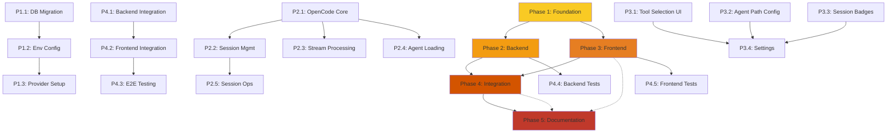

# OpenCode Integration Implementation Plan

> **Project**: Add OpenCode support to Agentic Kanban Board
> **Status**: 🟡 Planning
> **Start Date**: TBD
> **Target Date**: TBD (2-3 weeks)
> **Primary Contact**: TBD

---

## Quick Reference

| Metric | Value |
|--------|-------|
| **Total Estimated Time** | 2-3 weeks (1-2 developers) |
| **Total Hours Estimated** | 200-280 hours |
| **Critical Path** | Phase 1 → Phase 2.1 → 2.2 → 4.1 → 4.3 |
| **Parallel Work Available** | Phase 2.2/2.3/2.4, Phase 3, Phase 5 |
| **Risk Level** | Medium |

---

## Progress Summary

### Overall Progress: 0%

| Phase | Status | Progress | Assigned To | Start Date | End Date |
|-------|--------|----------|--------------|------------|-----------|
| Phase 1: Foundation & Database Migration | ⬜ Not Started | 0% | TBD | TBD |
| Phase 2: Backend Provider Implementation | ⬜ Not Started | 0% | TBD | TBD |
| Phase 3: Frontend UI Updates | ⬜ Not Started | 0% | TBD | TBD |
| Phase 4: Integration & Testing | ⬜ Not Started | 0% | TBD | TBD |
| Phase 5: Documentation & Polish | ⬜ Not Started | 0% | TBD | TBD |

### Task Completion

- [ ] Phase 1: Foundation (0/3 tasks)
- [ ] Phase 2: Backend (0/5 tasks)
- [ ] Phase 3: Frontend (0/5 tasks)
- [ ] Phase 4: Integration (0/5 tasks)
- [ ] Phase 5: Documentation (0/3 tasks)

---

## Phase 1: Foundation & Database Migration (Week 1, Days 1-3)

**Status**: ⬜ Not Started
**Blocking**: YES - Must complete before any other phase
**Estimated Time**: 14-21 hours

### 1.1 Database Schema Migration

**Estimated Time**: 8-12 hours | **Priority**: P0 (Critical)

- [ ] Review migration `001_add_provider_support.ts` and verify SQL statements
- [ ] Create backup of existing database (`backend/data/claude-sessions.db`)
- [ ] Apply migration to add `tool_type` column with DEFAULT 'claude'
- [ ] Rename `claude_session_id` → `tool_session_id`
- [ ] Update all database queries referencing `claude_session_id`
- [ ] Backfill existing sessions with `tool_type = 'claude'`
- [ ] Test migration rollback procedure
- [ ] Verify data integrity after migration

**Files to modify:**
- `backend/src/repositories/SessionRepository.ts` (13+ references to `claude_session_id`)
- `backend/src/database/database.ts` (column creation logic)
- `backend/src/types/session.types.ts` (rename field)

**Notes:**
> Be extremely careful with this migration. Create multiple backups before running.

### 1.2 Environment Configuration

**Estimated Time**: 2-3 hours | **Priority**: P0 (Critical)

**CRITICAL CORRECTION**: OpenCode is a LOCAL CLI tool, NOT an external API service

- [ ] Add `OPENCODE_EXECUTABLE` to `.env.example` (path to `opencode` binary)
- [ ] Add `OPENCODE_CONFIG_DIR` to `.env.example` with default `~/.config/opencode/`
- [ ] Add `OPENCODE_CONFIG` to `.env.example` (path to `opencode.json`)
- [ ] Add `OPENCODE_MODEL` to `.env.example` (default model: `anthropic/claude-sonnet-4-20250514`)
- [ ] Update `backend/src/config/env.config.ts` to parse OpenCode env vars
- [ ] Create config validation for required OpenCode fields
- [ ] Add provider selection logic to `ProviderConfigManager`

**Files to modify:**
- `backend/.env.example`
- `frontend/.env.example`
- `backend/src/config/env.config.ts`
- `backend/src/config/ProviderConfigManager.ts`

**Notes:**
> **OpenCode does NOT use API keys** - it's a local CLI tool like Claude Code.
> It uses provider/model format (e.g., `anthropic/claude-sonnet-4-20250514`)
> Configuration stored in `opencode.json` and `~/.config/opencode/` directory
> See: https://opencode.ai/docs/cli/#environment-variables

### 1.3 Provider Registration Setup

**Estimated Time**: 2-3 hours | **Priority**: P1 (High)

- [ ] Update `backend/src/providers/index.ts` to register OpenCode provider
- [ ] Add placeholder `OpenCodeProvider` export
- [ ] Update `ProviderFactory.register()` calls in app startup
- [ ] Add provider availability check at startup

**Files to modify:**
- `backend/src/providers/index.ts`
- `backend/src/app.ts` (or main entry point)

**Notes:**
> This is just scaffolding - actual implementation comes in Phase 2.

---

## Phase 2: Backend Provider Implementation (Week 1-2)

**Status**: ⬜ Not Started
**Dependencies**: Phase 1 complete
**Estimated Time**: 54-72 hours

### 2.1 OpenCodeProvider Core

**Estimated Time**: 16-20 hours | **Priority**: P0 (Critical)
**Dependencies**: Phase 1 complete

**CRITICAL DECISION POINT: Choose CLI Mode or Server Mode**

**Option A: CLI Spawn Mode (Recommended - Like Claude Code)**
```typescript
async initialize(config: OpenCodeProviderConfig) {
  // Config validation
  this.executablePath = config.executablePath || 'opencode';
  this.config = config;
  
  // Process spawning (like Claude Code's ProcessManager)
  this.processes = new Map<string, ChildProcess>();
}

async createSession(options: SessionOptions): Promise<ToolSession> {
  // Spawn: opencode --format json --dir <workingDir>
  const args = [
    this.executablePath,
    '--format', 'json',
    '--dir', options.workingDirectory
  ];
  
  const process = spawn(this.executablePath, args);
  this.processes.set(sessionId, process);
  
  // Parse JSONL output from stdout
  process.stdout.on('data', (chunk) => {
    // Parse JSONL events
  });
  
  // Track session ID from output
}
```

**Option B: HTTP Server Mode (More Complex)**
```typescript
// Requires running: opencode serve --port 4096
async initialize(config: OpenCodeProviderConfig) {
  this.serverUrl = config.serverUrl || 'http://localhost:4096';
  
  // Use HTTP API
  const client = new OpenCodeClient(this.serverUrl);
}

async createSession(options: SessionOptions): Promise<ToolSession> {
  const response = await this.client.createSession(options);
  return response;
}
```

**Tasks:**
- [ ] Create `backend/src/providers/OpenCodeProvider.ts`
- [ ] Implement `IToolProvider` interface
- [ ] Define OpenCode capabilities:
  ```typescript
  capabilities: {
    supportsAgents: true,  // OpenCode supports skills
    supportsResume: true,
    supportsContinue: true,
    realTimeStreaming: true,
    supportedTools: ['file:read', 'file:write', 'edit', 'bash', 'grep', 'glob'],
    maxContextTokens: 200000,
    requiresNetwork: true,  // For model providers
    isLocal: true  // Local CLI, not remote API
  }
  ```
- [ ] Implement `initialize(config)` - store executable path and config
- [ ] Choose CLI Mode OR Server Mode (see above)
- [ ] Add error handling for process/HTTP failures

**OpenCode Documentation:**
- CLI: https://opencode.ai/docs/cli
- Server API: https://opencode.ai/docs/server
- Agents: https://opencode.ai/docs/agents

**Notes:**
> **RECOMMENDATION**: Start with CLI Spawn Mode (Option A) for simplicity and consistency with Claude Code
> Server mode requires running `opencode serve` separately and managing server lifecycle

### 2.2 Session Management

**Estimated Time**: 12-16 hours | **Priority**: P0 (Critical)
**Dependencies**: 2.1 complete
**Can Parallel With**: 2.3

- [ ] Implement `createSession(options: SessionOptions)` method
- [ ] Implement `resumeSession(context: ResumeContext)` method
- [ ] Implement `continueSession(sessionId, input)` method
- [ ] Create OpenCode session tracking map (like Claude's `processInfo`)
- [ ] Implement session lifecycle management
- [ ] Add timeout handling for sessions

**OpenCode API Integration Required:**
- Session creation endpoint
- Session resume endpoint
- Message sending endpoint
- Stream response handling

**Notes:**
> Need to map OpenCode's session model to our `ToolSession` interface.

### 2.3 Stream Processing

**Estimated Time**: 10-14 hours | **Priority**: P1 (High)
**Dependencies**: 2.1 complete
**Can Parallel With**: 2.2

- [ ] Create `backend/src/parsers/OpenCodeStreamParser.ts`
- [ ] Implement OpenCode-specific JSON/event format parsing
- [ ] Convert OpenCode events to standardized `StreamEvent` format
- [ ] Handle OpenCode tool call events
- [ ] Parse thinking/reasoning events if available
- [ ] Implement buffer management for incomplete JSON chunks
- [ ] Add error recovery for malformed events

**OpenCode Event Format to Support:**
- Message deltas
- Tool calls
- Tool outputs
- Session ID
- Thinking/reasoning (if available)

**Files to create:**
- `backend/src/parsers/OpenCodeStreamParser.ts`
- `backend/src/parsers/ISessionStreamParser.ts` (if not exists)

**Notes:**
> Need OpenCode's streaming response format documentation.

### 2.4 Agent Loading

**Estimated Time**: 8-10 hours | **Priority**: P1 (High)
**Dependencies**: 2.1 complete
**Can Parallel With**: 2.2, 2.3

- [ ] Implement `loadAgents(agentsPath: string)` method
- [ ] Read OpenCode skills from `~/.config/opencode/plugins/` or similar
- [ ] Parse skill files (`.md` or OpenCode-specific format)
- [ ] Return standardized `Agent[]` array
- [ ] Add skill metadata extraction (name, description, system prompt)
- [ ] Handle skill directory not found gracefully

**OpenCode Skills Directory:** Likely `~/.config/opencode/plugins/` (verify)

**Notes:**
> Need to understand OpenCode's skill format and directory structure.

### 2.5 Session Operations

**Estimated Time**: 8-12 hours | **Priority**: P1 (High)
**Dependencies**: 2.2 complete

- [ ] Implement `sendInput(sessionId, input)` method
- [ ] Implement `interrupt(sessionId)` method (if OpenCode supports it)
- [ ] Implement `closeSession(sessionId)` method
- [ ] Implement `getSessionStatus(sessionId)` method
- [ ] Implement `getSessionMetrics(sessionId)` method
- [ ] Add WebSocket event emission for status changes
- [ ] Handle session cleanup on errors/timeouts

**Notes:**
> Check if OpenCode supports session interruption.

---

## Phase 3: Frontend UI Updates (Can Start During Phase 2)

**Status**: ⬜ Not Started
**Dependencies**: Phase 1 complete, backend API endpoints defined
**Estimated Time**: 38-48 hours

### 3.1 Tool Selection UI

**Estimated Time**: 8-10 hours | **Priority**: P0 (Critical)
**Can Start**: During Phase 2

- [ ] Add tool type dropdown to "Create Session" modal
- [ ] Options: "Claude Code", "OpenCode", "Cursor", "KiloCode", "Codex"
- [ ] Only enable currently implemented tools (Claude + OpenCode initially)
- [ ] Show tool-specific configuration fields based on selection
- [ ] Update i18n locale files with new labels
  - `en/common.json`: Add tool names
  - `es/common.json`: Add Spanish translations
  - `zh-CN/common.json`: Add Chinese translations
  - `zh-TW/common.json`: Add Traditional Chinese translations
  - `ja/common.json`: Add Japanese translations
  - `pt/common.json`: Add Portuguese translations

**Files to modify:**
- `frontend/src/components/CreateSessionModal.tsx`
- `frontend/src/i18n/locales/*/common.json`

**Notes:**
> Only enable implemented tools in production; show "Coming Soon" for others.

### 3.2 Agent Path Configuration

**Estimated Time**: 4-6 hours | **Priority**: P1 (High)
**Can Start**: During Phase 2

**CRITICAL PATH CORRECTION:**
- [ ] Claude: `~/.claude/agents/` ✅
- [ ] OpenCode: `~/.config/opencode/agents/` ✅ (NOT `~/.opencode/skills/`)
- [ ] Remove: Cursor, KiloCode, Codex (not implementing yet)

- [ ] Update AgentPromptsPage to use correct OpenCode path
- [ ] Remove validation for other tools (not in scope)

**Files to modify:**
- `frontend/src/pages/AgentPromptsPage.tsx`
- `frontend/src/types/config.types.ts`

**Notes:**
> Only Claude and OpenCode in this phase
> Path confirmed: `~/.config/opencode/agents/`
> Source: https://opencode.ai/docs/agents

### 3.3 Session List Badges

**Estimated Time**: 8-10 hours | **Priority**: P1 (High)
**Can Start**: During Phase 2

- [ ] Add tool type badge to session cards in list view
- [ ] Color coding:
  - Claude: Green (#10B981)
  - OpenCode: Blue (#3B82F6)
  - Cursor: Purple (#8B5CF6)
  - KiloCode: Orange (#F97316)
  - Codex: Cyan (#06B6D4)
- [ ] Show tool icon next to session name
- [ ] Filter sessions by tool type
- [ ] Update session detail header to show tool info

**Files to modify:**
- `frontend/src/components/SessionList.tsx` or similar
- `frontend/src/components/SessionCard.tsx`
- `frontend/src/components/SessionDetail.tsx`

**Notes:**
> Add SVG icons for each tool brand.

### 3.4 Tool-Specific Settings

**Estimated Time**: 10-12 hours | **Priority**: P1 (High)
**Can Start**: During Phase 2

- [ ] Create "Providers" settings section
- [ ] Add OpenCode configuration:
  - API Key input (password field)
  - Base URL input
  - Test connection button
- [ ] Add Claude configuration (refactor from existing):
  - Executable path
  - Timeout settings
- [ ] Add credential storage (localStorage or encrypted DB)
- [ ] Add provider enable/disable toggles
- [ ] Add status indicator (connected/disconnected) per provider

**Files to modify:**
- `frontend/src/pages/Settings.tsx`
- `frontend/src/services/api.ts`
- `frontend/src/types/settings.types.ts`

**Notes:**
> Consider using a secure storage mechanism for API keys.

### 3.5 Message Type Handling

**Estimated Time**: 6-8 hours | **Priority**: P2 (Medium)
**Can Start**: During Phase 2

- [ ] Update `MessageFilter.tsx` to handle OpenCode message types
- [ ] Ensure OpenCode tool calls render correctly
- [ ] Add OpenCode-specific icon for tool calls
- [ ] Test message rendering with different tool outputs
- [ ] Handle OpenCode-specific error messages

**Files to modify:**
- `frontend/src/components/Session/MessageFilter.tsx`
- `frontend/src/components/Session/MessageItem.tsx`
- `frontend/src/components/Session/ToolCallMessage.tsx` (if exists)

**Notes:**
> OpenCode's tool call format might differ from Claude's.

---

## Phase 4: Integration & Testing (Week 2-3)

**Status**: ⬜ Not Started
**Dependencies**: Phase 2 & 3 mostly complete
**Estimated Time**: 76-96 hours

### 4.1 Backend Integration

**Estimated Time**: 16-20 hours | **Priority**: P0 (Critical)
**Dependencies**: Phase 2 complete, Phase 3 complete

- [ ] Register `OpenCodeProvider` in `ProviderFactory` at startup
- [ ] Update `SessionService` to route requests to correct provider
- [ ] Replace hardcoded Claude CLI calls in `ProcessManager` with provider calls
- [ ] Update `StreamProcessor` to use provider-specific parsers
- [ ] Add provider switching logic for session creation
- [ ] Test session creation with both tools
- [ ] Test session resume with both tools

**Files to modify:**
- `backend/src/services/SessionService.ts`
- `backend/src/services/ProcessManager.ts` (major refactor)
- `backend/src/services/StreamProcessor.ts`
- `backend/src/services/UnifiedStreamProcessor.ts`

**Notes:**
> This is a major refactor. Consider feature flags for gradual rollout.

### 4.2 Frontend Integration

**Estimated Time**: 12-16 hours | **Priority**: P0 (Critical)
**Dependencies**: Phase 3 complete, Phase 4.1 started

- [ ] Connect tool selection dropdown to backend API
- [ ] Pass tool_type in session creation requests
- [ ] Update WebSocket message handling for OpenCode events
- [ ] Test real-time streaming with OpenCode
- [ ] Test message rendering for OpenCode responses
- [ ] Test tool call visualization for OpenCode

**Notes:**
> Need to ensure WebSocket protocol works with OpenCode's events.

### 4.3 End-to-End Testing

**Estimated Time**: 16-20 hours | **Priority**: P0 (Critical)
**Dependencies**: Phase 4.1 & 4.2 complete

- [ ] Test complete flow: Create OpenCode session → Send message → Receive response
- [ ] Test OpenCode agent loading and selection
- [ ] Test workflow stages with OpenCode agents
- [ ] Test session resume/continue with OpenCode
- [ ] Test multi-session scenarios (Claude + OpenCode simultaneously)
- [ ] Test error handling (API failures, timeouts)
- [ ] Test session interruption and cleanup
- [ ] Cross-browser testing (Chrome, Firefox, Edge, Safari)
- [ ] Performance testing (concurrent sessions, long messages)

**Test Plan:**
> Create a detailed test checklist document before starting.

### 4.4 Backend Unit Tests

**Estimated Time**: 20-24 hours | **Priority**: P1 (High)
**Dependencies**: Phase 2 complete

- [ ] Write `OpenCodeProvider` unit tests
  - Test initialization
  - Test session creation
  - Test session resume
  - Test session continuation
  - Test error handling
- [ ] Write `OpenCodeStreamParser` unit tests
  - Test valid event parsing
  - Test incomplete chunk buffering
  - Test error recovery
  - Test malformed JSON handling
- [ ] Write integration tests for session lifecycle
- [ ] Write tests for agent loading
- [ ] Mock OpenCode API responses
- [ ] Achieve 80%+ code coverage for new code

**Files to create:**
- `backend/src/providers/__tests__/OpenCodeProvider.test.ts`
- `backend/src/parsers/__tests__/OpenCodeStreamParser.test.ts`

**Notes:**
> Use existing ClaudeProvider tests as reference.

### 4.5 Frontend Unit Tests

**Estimated Time**: 12-16 hours | **Priority**: P1 (High)
**Dependencies**: Phase 3 complete

- [ ] Write tests for tool selection component
- [ ] Write tests for session rendering with OpenCode
- [ ] Write tests for settings page (provider configuration)
- [ ] Test WebSocket event handling
- [ ] Mock backend API responses
- [ ] Test error states
- [ ] Test loading states

**Files to create:**
- `frontend/src/components/__tests__/ToolSelector.test.tsx`
- `frontend/src/pages/__tests__/Settings.test.tsx`

**Notes:**
> Consider using React Testing Library.

---

## Phase 5: Documentation & Polish (Week 3)

**Status**: ⬜ Not Started
**Dependencies**: Phase 4 in progress
**Estimated Time**: 28-38 hours
**Can Run**: In parallel with Phase 4

### 5.1 Documentation

**Estimated Time**: 8-10 hours | **Priority**: P1 (High)
**Can Start**: During Phase 4

- [ ] Update README.md with OpenCode support
- [ ] Add OpenCode installation section
- [ ] Create "Multi-Tool Usage" guide
- [ ] Update API documentation with provider endpoints
- [ ] Add OpenCode troubleshooting section
- [ ] Create migration guide for existing users
- [ ] Update wiki pages with tool-specific info
  - Home.md
  - Installation.md
  - Configuration.md
  - Usage.md
  - Architecture.md

**Files to modify:**
- `README.md`
- `docs/wiki/*.md`
- Create new: `docs/wiki/Multi-Tool-Guide.md`

**Notes:**
> Document both tools equally - don't show preference.

### 5.2 Migration Script

**Estimated Time**: 8-12 hours | **Priority**: P0 (Critical)
**Can Start**: During Phase 4

- [ ] Create automated migration script for existing users
  - `scripts/migrate-to-multitool.js`
- [ ] Handle edge cases:
  - Corrupted databases
  - Missing backups
  - Permission issues
  - Partial migrations
- [ ] Add migration rollback capability
- [ ] Test migration on production-like database
- [ ] Add progress indicators and logging
- [ ] Document migration process

**Files to create:**
- `scripts/migrate-to-multitool.js`
- `scripts/rollback-migration.js`

**Notes:**
> Test migration script on multiple database states.

### 5.3 Polish & Bug Fixes

**Estimated Time**: 12-16 hours | **Priority**: P2 (Medium)
**Can Start**: During Phase 4

- [ ] Fix UI/UX issues found during testing
- [ ] Performance optimization
  - Reduce re-renders
  - Optimize WebSocket handling
  - Lazy load components
- [ ] Add loading states for provider switching
- [ ] Improve error messages (user-friendly)
- [ ] Add tooltips and help text
- [ ] Accessibility improvements (ARIA labels, keyboard nav)
- [ ] Add animations for smoother UX
- [ ] Fix any reported bugs

**Notes:**
> Create issue backlog from testing results.

---

## Dependency Graph



## Parallelization Opportunities

### Can Run in Parallel:
- **Phase 2.2, 2.3, 2.4**: After 2.1 completes, these can run independently
- **Phase 3**: Can run during Phase 2 (once API endpoints are defined)
- **Phase 5**: Can run during Phase 4 (documentation and polish don't need integration complete)

### Must Run Sequentially:
- **Phase 1 → Phase 2**: Database and config must be complete before provider implementation
- **Phase 2.1 → 2.2**: Session management depends on core provider
- **Phase 2.2 → 2.5**: Session operations depend on session management
- **Phase 2 & 3 → Phase 4**: Integration requires both backend and frontend mostly complete

---

## Risk Assessment

| Risk | Impact | Probability | Mitigation Strategy | Owner |
|------|--------|--------------|-------------------|--------|
| Database migration fails or corrupts data | **HIGH** | LOW | Multiple backups, test on copy, rollback procedure | TBD |
| OpenCode API changes or SDK issues | **MEDIUM** | MEDIUM | Version pin SDK, abstraction layer, document API contracts | TBD |
| Stream format incompatibility | **MEDIUM** | LOW | Document format, flexible parser, add examples | TBD |
| Frontend-backend contract mismatch | **MEDIUM** | MEDIUM | Shared TypeScript types, early integration, contract tests | TBD |
| Performance regression with multiple tools | **LOW** | MEDIUM | Load testing, benchmarks, profiling | TBD |
| Claude functionality breakage during refactoring | **HIGH** | LOW | Extensive tests, feature flags, gradual rollout | TBD |
| OpenCode authentication issues | **MEDIUM** | LOW | Document auth flow, test with real keys, error handling | TBD |
| Insufficient OpenCode documentation | **MEDIUM** | HIGH | Research early, reach out to OpenCode team, community forums | TBD |

---

## Resource Requirements

### Personnel
- [ ] 1 Backend Developer (TypeScript/Node.js)
- [ ] 1 Frontend Developer (React/TypeScript)
- [ ] 1 QA Engineer (for Phase 4)
- [ ] 1 Technical Writer (for Phase 5)

### Tools & Services
- [ ] OpenCode API access (API keys)
- [ ] OpenCode development account
- [ ] Test environments (staging, production-like)
- [ ] CI/CD pipeline for testing

### Documentation
- [ ] OpenCode SDK documentation
- [ ] OpenCode API reference
- [ ] Existing codebase documentation
- [ ] Multi-tool architecture plan (`docs/MULTI_TOOL_ARCHITECTURE_PLAN.md`)

---

## Communication & Coordination

### Daily Standups (Recommended)
- Time: TBD (e.g., 9:00 AM EST)
- Duration: 15 minutes
- Format: What I did, What I'll do, Blockers

### Weekly Syncs
- Time: TBD (e.g., Friday 3:00 PM EST)
- Duration: 45-60 minutes
- Agenda: Progress review, Demo, Planning next week

### Issue Tracking
- Use GitHub Issues for:
  - Bug reports
  - Feature requests
  - Questions/discussion
- Label issues with:
  - `opencode` - OpenCode-specific
  - `backend` - Backend work
  - `frontend` - Frontend work
  - `phase-X` - Which phase
  - `priority-critical` - P0 issues

---

## Success Criteria

Phase 1 Complete:
- [ ] Database migration applied without errors
- [ ] All existing sessions have `tool_type = 'claude'`
- [ ] Environment variables documented in `.env.example`
- [ ] Provider registration scaffolding in place

Phase 2 Complete:
- [ ] `OpenCodeProvider` implements `IToolProvider` interface
- [ ] OpenCode sessions can be created, resumed, and continued
- [ ] OpenCode agents load from correct directory
- [ ] OpenCode stream parsing works correctly
- [ ] All unit tests pass with 80%+ coverage

Phase 3 Complete:
- [ ] Users can select tool type when creating sessions
- [ ] Tool type badges show on all sessions
- [ ] Settings page has OpenCode configuration
- [ ] All i18n translations updated
- [ ] All frontend unit tests pass

Phase 4 Complete:
- [ ] OpenCode sessions work end-to-end
- [ ] Both Claude and OpenCode can run simultaneously
- [ ] All tests pass (unit + integration + E2E)
- [ ] No regressions in Claude functionality
- [ ] Performance meets benchmarks

Phase 5 Complete:
- [ ] Documentation updated for multi-tool support
- [ ] Migration script tested and verified
- [ ] All known bugs from testing fixed
- [ ] README updated with OpenCode section
- [ ] Release notes prepared

---

## Change Log

| Date | Phase | Change | Author |
|-------|-------|---------|---------|
| 2025-02-14 | Initial | Created implementation plan | Sisyphus |

---

## Notes & Questions

### Research Needed:
- [ ] OpenCode SDK documentation and capabilities
- [ ] OpenCode API authentication flow
- [ ] OpenCode streaming response format
- [ ] OpenCode skills directory structure and format
- [ ] OpenCode tool call format
- [ ] OpenCode session lifecycle details
- [ ] Cursor/KiloCode/Codex capabilities (for future)

### Decisions Needed:
- [ ] Should we add feature flags for gradual rollout?
- [ ] How to store OpenCode API keys securely?
- [ ] Should we support per-tool workspace directories?
- [ ] Migration strategy for existing users (auto vs manual)?

### Questions for Stakeholders:
- [ ] Timeline for OpenCode integration?
- [ ] Priority vs other features?
- [ ] Budget for OpenCode API usage?
- [ ] Which tools after OpenCode (priority order)?
- [ ] Who owns OpenCode maintenance after implementation?

---

**Last Updated**: 2025-02-14
**Next Review**: TBD
**Document Version**: 1.0
