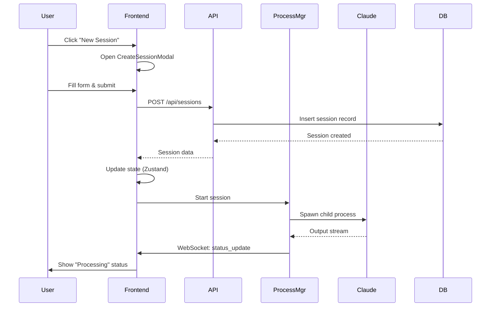
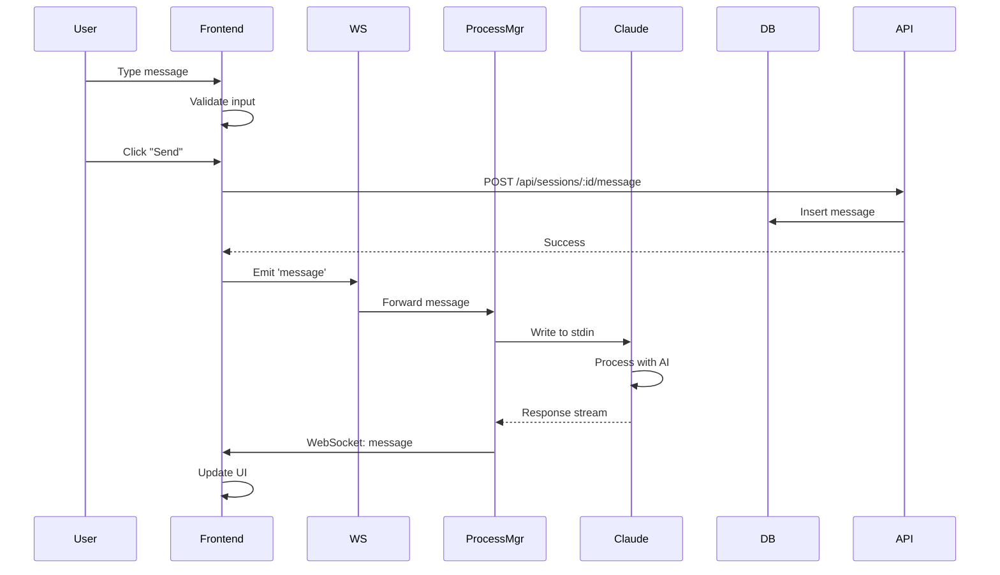
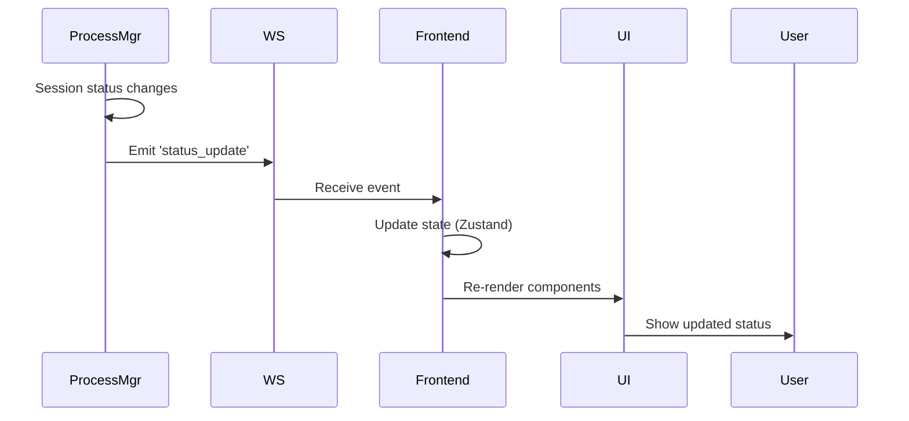
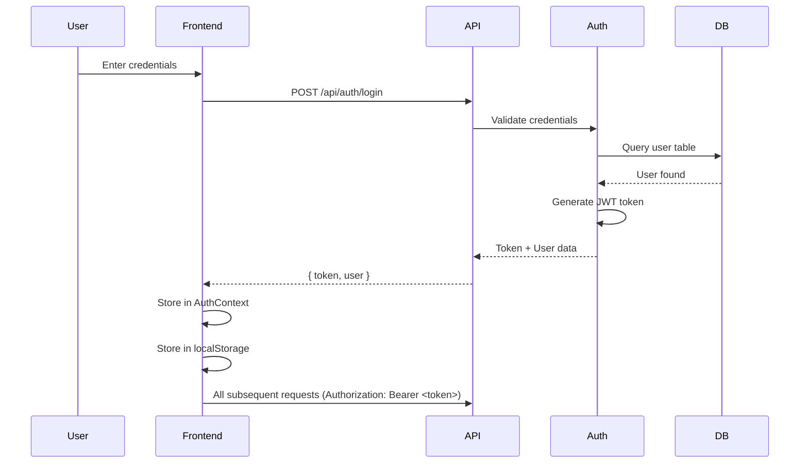

# Architecture

Deep dive into Agentic Kanban Board system architecture.

## System Overview

Agentic Kanban Board follows a client-server architecture with real-time WebSocket communication for seamless user experience.

```mermaid
graph TB
    subgraph "Client Layer (Frontend)"
        UI[React UI Components]
        State[Zustand State Stores]
        Socket[Socket.io Client]
        API[HTTP Client (Axios)]
    end

    subgraph "Server Layer (Backend)"
        Express[Express Server]
        SocketServer[Socket.io Server]
        ProcessMgr[ProcessManager Service]
        Auth[Authentication Middleware]
        Controllers[Route Controllers]
        Services[Business Logic Services]
        Repositories[Data Access Layer]
    end

    subgraph "Data Layer"
        DB[(SQLite Database)]
        Files[File System<br/>Agent Files]
    end

    subgraph "External Services"
        Claude[Claude Code CLI<br/>Child Processes]
    end

    UI --> State
    UI --> API
    UI --> Socket

    State -->|Read/Write| API

    API -->|HTTP Request| Express
    Socket -->|WebSocket Connection| SocketServer

    Express --> Auth
    Auth --> Controllers
    Controllers --> Services
    Services --> Repositories
    Repositories --> DB

    Controllers --> ProcessMgr
    Services --> ProcessMgr

    ProcessMgr -->|Spawn| Claude
    ProcessMgr -->|Read| Files

    SocketServer -->|Events| Socket

    style UI fill:#4CAF50
    style Express fill:#2196F3
    style ProcessMgr fill:#FF9800
    style DB fill:#607D8B
    style Claude fill:#9C27B0
```

## Frontend Architecture

### Component Hierarchy

```
App
├── I18nProvider (Internationalization)
├── AuthProvider (Authentication Context)
├── SessionsProvider (Sessions Context)
├── Router
│   ├── ProtectedRoute (Auth Guard)
│   ├── Layout
│   │   ├── Sidebar
│   │   ├── Header
│   │   └── LanguageToggle
│   └── Pages
│       ├── SessionPage (SplitView)
│       │   ├── SessionList
│       │   │   ├── SessionCard
│       │   │   └── MessageFilter
│       │   └── SessionDetail
│       │       ├── MessageInput
│       │       └── MessageList
│       │           └── MessageItem
│       ├── WorkflowStages
│       ├── WorkItemListPage
│       │   └── WorkItemCard
│       ├── WorkItemDetailPage
│       ├── AgentPromptsPage
│       └── AgentPromptDetailPage
└── CreateSessionModal
```

### State Management (Zustand)

The application uses Zustand for client-side state management:

```typescript
// sessionStore.ts - Session state
export const useSessionStore = create<SessionStore>((set, get) => ({
  sessions: [],
  currentSession: null,
  filters: { status: 'all', projectId: null },
  actions: {
    fetchSessions: async () => { ... },
    setCurrentSession: (session) => { ... },
    updateSession: (id, updates) => { ... },
    deleteSession: (id) => { ... },
    setFilters: (filters) => { ... },
  }
}));

// workItemStore.ts - Work item state
export const useWorkItemStore = create<WorkItemStore>((set) => ({
  workItems: [],
  currentWorkItem: null,
  actions: {
    fetchWorkItems: async () => { ... },
    createWorkItem: async (data) => { ... },
    updateWorkItem: async (id, data) => { ... },
    deleteWorkItem: async (id) => { ... },
  }
}));

// workflowStageStore.ts - Workflow stage state
export const useWorkflowStageStore = create<WorkflowStageStore>((set) => ({
  workflowStages: [],
  actions: {
    fetchWorkflowStages: async () => { ... },
    createWorkflowStage: async (data) => { ... },
    updateWorkflowStage: async (id, data) => { ... },
    deleteWorkflowStage: async (id) => { ... },
  }
}));
```

### React Contexts

#### AuthContext
```typescript
interface AuthContextType {
  user: User | null;
  token: string | null;
  login: (username: string, password: string) => Promise<void>;
  logout: () => void;
  isAuthenticated: boolean;
}
```

#### SessionsContext
```typescript
interface SessionsContextType {
  sessions: Session[];
  currentSession: Session | null;
  fetchSessions: () => Promise<void>;
  createSession: (data: CreateSessionData) => Promise<Session>;
  updateSession: (id: string, data: Partial<Session>) => Promise<void>;
  deleteSession: (id: string) => Promise<void>;
}
```

#### I18nContext
```typescript
interface I18nContextType {
  language: string;
  changeLanguage: (lang: string) => void;
  t: (key: string, params?: Record<string, any>) => string;
}
```

### Custom Hooks

#### useWebSocket
Manages WebSocket connection and event listeners:

```typescript
function useWebSocket() {
  const [isConnected, setIsConnected] = useState(false);
  const [connectionError, setConnectionError] = useState<Error | null>(null);

  useEffect(() => {
    const socket = io(VITE_SOCKET_URL);

    socket.on('connect', () => setIsConnected(true));
    socket.on('disconnect', () => setIsConnected(false));
    socket.on('error', setConnectionError);

    return () => socket.disconnect();
  }, []);

  return { isConnected, connectionError };
}
```

#### useNotifications
Handles desktop notifications:

```typescript
function useNotifications() {
  useEffect(() => {
    if (Notification.permission === 'default') {
      Notification.requestPermission();
    }
  }, []);

  const notify = (title: string, body: string) => {
    new Notification(title, { body });
  };

  return { notify };
}
```

## Backend Architecture

### Layered Architecture

```
Server Layer
├── HTTP Routes (Express Router)
│   └── Authentication Middleware
├── Controllers (Request Handlers)
│   ├── SessionController
│   ├── WorkItemController
│   ├── WorkflowStageController
│   ├── AgentPromptController
│   ├── ProjectController
│   ├── TagController
│   └── TaskTemplateController
├── Services (Business Logic)
│   ├── SessionService
│   ├── WorkItemService
│   ├── WorkflowStageService
│   ├── AgentPromptService
│   ├── ProcessManager
│   ├── StreamProcessor
│   ├── MessageAccumulator
│   └── NotificationService
├── Repositories (Data Access)
│   ├── SessionRepository
│   ├── WorkItemRepository
│   ├── WorkflowStageRepository
│   ├── AgentPromptRepository
│   ├── ProjectRepository
│   ├── TagRepository
│   └── TaskTemplateRepository
└── Database (SQLite via Knex.js)
```

### Key Services

#### ProcessManager
Manages child processes for Claude Code CLI sessions:

```typescript
class ProcessManager extends EventEmitter {
  private sessions: Map<string, SessionProcess>;

  async startSession(sessionId: string, config: SessionConfig): Promise<void> {
    // 1. Spawn Claude Code CLI as child process
    const process = spawn('claude', ['--cwd', config.workingDir]);

    // 2. Set up stdin/stdout/stderr streams
    process.stdin.write(config.task);

    // 3. Process output with StreamProcessor
    const streamProcessor = new StreamProcessor(sessionId, process.stdout);
    streamProcessor.on('message', (msg) => this.emit('message', msg));
    streamProcessor.on('status', (status) => this.emit('statusUpdate', status));

    // 4. Store process reference
    this.sessions.set(sessionId, { process, config, status: 'processing' });
  }

  async interruptSession(sessionId: string): Promise<void> {
    const session = this.sessions.get(sessionId);
    if (session?.process) {
      session.process.kill('SIGTERM');
    }
  }

  async resumeSession(sessionId: string): Promise<void> {
    // Resume interrupted session
  }

  async shutdown(): Promise<void> {
    // Terminate all sessions gracefully
  }
}
```

#### StreamProcessor
Parses and processes Claude Code CLI output streams:

```typescript
class StreamProcessor extends EventEmitter {
  private buffer: string = '';
  private messageAccumulator: MessageAccumulator;

  constructor(sessionId: string, stream: Readable) {
    super();
    this.messageAccumulator = new MessageAccumulator(sessionId);

    stream.on('data', (chunk) => {
      this.buffer += chunk.toString();
      this.parseBuffer();
    });
  }

  private parseBuffer() {
    // Parse streaming JSON responses
    const lines = this.buffer.split('\n');
    for (const line of lines) {
      if (this.isCompleteMessage(line)) {
        const message = JSON.parse(line);
        this.messageAccumulator.add(message);
        this.emit('message', message);
      }
    }
  }
}
```

#### MessageAccumulator
Accumulates and stores session messages:

```typescript
class MessageAccumulator {
  private messages: Message[] = [];

  add(message: Message): void {
    this.messages.push(message);
    // Persist to database
    this.saveToDatabase(message);
  }

  getAll(): Message[] {
    return this.messages;
  }

  clear(): void {
    this.messages = [];
  }
}
```

### Database Schema

#### Sessions Table
```sql
CREATE TABLE sessions (
  id TEXT PRIMARY KEY,
  name TEXT NOT NULL,
  status TEXT NOT NULL, -- 'idle', 'processing', 'completed', 'error', 'interrupted'
  working_dir TEXT NOT NULL,
  work_item_id TEXT,
  project_id TEXT,
  workflow_stage_id INTEGER,
  agent_id INTEGER,
  task TEXT,
  continue_from_session_id TEXT,
  created_at TEXT NOT NULL,
  updated_at TEXT NOT NULL,
  completed_at TEXT,
  FOREIGN KEY (work_item_id) REFERENCES work_items(id),
  FOREIGN KEY (project_id) REFERENCES projects(id),
  FOREIGN KEY (workflow_stage_id) REFERENCES workflow_stages(id),
  FOREIGN KEY (agent_id) REFERENCES agents(id)
);
```

#### Messages Table
```sql
CREATE TABLE messages (
  id TEXT PRIMARY KEY,
  session_id TEXT NOT NULL,
  role TEXT NOT NULL, -- 'user', 'assistant', 'system', 'tool_use'
  content TEXT NOT NULL,
  metadata TEXT, -- JSON string for additional data
  timestamp TEXT NOT NULL,
  FOREIGN KEY (session_id) REFERENCES sessions(id) ON DELETE CASCADE
);
```

#### Workflow Stages Table
```sql
CREATE TABLE workflow_stages (
  id INTEGER PRIMARY KEY AUTOINCREMENT,
  name TEXT NOT NULL,
  description TEXT,
  prompt_type TEXT NOT NULL, -- 'custom', 'agent'
  agent_id INTEGER,
  custom_prompt TEXT,
  color TEXT,
  suggested_tasks TEXT, -- JSON array
  created_at TEXT NOT NULL,
  updated_at TEXT NOT NULL,
  FOREIGN KEY (agent_id) REFERENCES agents(id)
);
```

#### Work Items Table
```sql
CREATE TABLE work_items (
  id TEXT PRIMARY KEY,
  name TEXT NOT NULL,
  description TEXT,
  status TEXT NOT NULL, -- 'planning', 'in-progress', 'completed', 'cancelled'
  priority TEXT NOT NULL, -- 'low', 'medium', 'high'
  project_id TEXT,
  working_dir TEXT NOT NULL,
  created_at TEXT NOT NULL,
  updated_at TEXT NOT NULL,
  FOREIGN KEY (project_id) REFERENCES projects(id)
);
```

#### Projects Table
```sql
CREATE TABLE projects (
  id TEXT PRIMARY KEY,
  name TEXT NOT NULL,
  description TEXT,
  working_dir TEXT NOT NULL,
  created_at TEXT NOT NULL,
  updated_at TEXT NOT NULL
);
```

#### Agents Table
```sql
CREATE TABLE agents (
  id INTEGER PRIMARY KEY AUTOINCREMENT,
  name TEXT NOT NULL UNIQUE,
  path TEXT NOT NULL,
  content TEXT NOT NULL,
  created_at TEXT NOT NULL,
  updated_at TEXT NOT NULL
);
```

## Data Flow

### Session Creation Flow



### Message Sending Flow



### Real-time Status Updates



## WebSocket Communication

### Connection Lifecycle

```typescript
// Frontend: Connection setup
const socket = io(VITE_SOCKET_URL, {
  reconnection: true,
  reconnectionDelay: 1000,
  reconnectionAttempts: Infinity,
});

socket.on('connect', () => {
  console.log('Connected to WebSocket server');
  // Subscribe to session updates
  socket.emit('subscribe', currentSessionId);
});

socket.on('disconnect', () => {
  console.log('Disconnected from WebSocket server');
});

socket.on('reconnect', (attemptNumber) => {
  console.log(`Reconnected after ${attemptNumber} attempts`);
});
```

### Event Types

| Event | Direction | Data Format | Description |
|--------|-----------|-------------|-------------|
| `subscribe` | Client→Server | `string` (sessionId) | Subscribe to session updates |
| `unsubscribe` | Client→Server | `string` (sessionId) | Unsubscribe from session |
| `message` | Server→Client | `{ sessionId, type, content, timestamp }` | New chat message |
| `status_update` | Server→Client | `{ sessionId, status, timestamp }` | Session status changed |
| `process_started` | Server→Client | `{ sessionId, pid }` | Process spawned |
| `process_exit` | Server→Client | `{ sessionId, exitCode, signal }` | Process terminated |
| `error` | Server→Client | `{ sessionId, error, errorType, details }` | Error occurred |

## Authentication Flow



## Internationalization Architecture

### Translation Files Structure

```
frontend/src/i18n/locales/
├── en/
│   ├── common.json
│   ├── auth.json
│   ├── sidebar.json
│   ├── session.json
│   ├── workflow.json
│   └── workitem.json
├── zh-CN/
│   └── ... (same structure)
├── zh-TW/
│   └── ... (same structure)
├── es/
│   └── ... (same structure)
├── ja/
│   └── ... (same structure)
└── pt/
    └── ... (same structure)
```

### Translation Key Pattern

```typescript
// Usage in components
const { t } = useI18nContext();

// Simple key
t('session.create.title')

// With variables
t('session.list.itemsCount', { count: 5 })

// Nested keys
t('workflow.form.namePlaceholder')
```

## Security Architecture

### Current Security Measures

1. **JWT Authentication**:
   - Tokens signed with secret key
   - Configurable expiration (default: 24 hours)
   - Middleware validates tokens on protected routes

2. **Rate Limiting**:
   - Configurable request limits
   - Window-based limiting (default: 100 req/60s)
   - Response headers show current limits

3. **Input Validation**:
   - Zod schema validation on API endpoints
   - Type checking with TypeScript
   - Sanitization of user inputs

### Known Security Limitations

⚠️ **IMPORTANT**: This application is designed for personal use only and has security limitations:

- No HTTPS/SSL by default
- No CSRF protection
- No multi-user authentication
- No role-based access control (RBAC)
- No input sanitization beyond basic validation
- No database encryption at rest
- No audit logging for sensitive operations

### Recommended Security Enhancements for Production

1. **Enable HTTPS** with reverse proxy (Nginx/Apache)
2. **Implement CSRF** tokens for state-changing operations
3. **Add rate limiting** per user/IP
4. **Implement RBAC** for multi-user scenarios
5. **Add audit logging** for all sensitive operations
6. **Enable database encryption** for sensitive data
7. **Add input sanitization** and XSS protection
8. **Implement CSP** (Content Security Policy)
9. **Add helmet.js** security headers
10. **Regular security audits** and dependency updates

## Performance Optimizations

### Frontend Optimizations

1. **Code Splitting**: Dynamic imports for route components
2. **Memoization**: React.memo for expensive components
3. **Virtual Scrolling**: For long message lists (planned)
4. **Debouncing**: Search and filter inputs
5. **Lazy Loading**: Images and large content

### Backend Optimizations

1. **Connection Pooling**: Database connection reuse
2. **Query Optimization**: Indexed columns, proper joins
3. **Caching**: Agent file content caching
4. **Stream Processing**: Efficient parsing of CLI output
5. **Process Management**: Limits on concurrent sessions

### Database Optimizations

1. **Indexes**: Foreign keys and frequently queried columns
2. **Queries**: Optimized SELECT statements
3. **Transactions**: Batch operations
4. **Connection Pooling**: Reuse database connections

## Error Handling Strategy

### Frontend Error Handling

```typescript
// Error Boundary
<ErrorBoundary
  fallback={<ErrorFallback />}
  onError={(error, errorInfo) => {
    logger.error('React error:', error, errorInfo);
  }}
>
  <App />
</ErrorBoundary>

// API Error Handling
try {
  const response = await api.post('/api/sessions', data);
} catch (error) {
  if (axios.isAxiosError(error)) {
    const { status, data } = error.response;
    if (status === 401) {
      // Unauthorized - redirect to login
      navigate('/login');
    } else {
      toast.error(data.error || 'An error occurred');
    }
  }
}
```

### Backend Error Handling

```typescript
// Global error handler
app.use((error: Error, req: Request, res: Response, next: NextFunction) => {
  logger.error('Unhandled error:', error);

  if (error instanceof ValidationError) {
    return res.status(400).json({ error: error.message, details: error.details });
  }

  if (error instanceof UnauthorizedError) {
    return res.status(401).json({ error: 'Unauthorized' });
  }

  res.status(500).json({ error: 'Internal server error' });
});

// Process error handling
processManager.on('error', (data) => {
  logger.error(`Process error for session ${data.sessionId}:`, data.error);
  // Notify clients via WebSocket
  io.to(`session:${data.sessionId}`).emit('error', data);
});
```

## Scalability Considerations

### Current Limitations

1. **Single Process Backend**: No horizontal scaling
2. **SQLite Database**: Not suitable for high concurrency
3. **Process Management**: Limited concurrent sessions (configurable)
4. **No Message Queue**: WebSocket messages sent directly

### Scaling Options

1. **Multiple Backend Instances**: With load balancer
2. **PostgreSQL Migration**: Replace SQLite for production
3. **Redis Pub/Sub**: For WebSocket scaling across instances
4. **Message Queue**: RabbitMQ/Redis for async processing
5. **Microservices**: Split services into separate containers

---

## Next Steps

- [Installation Guide](Installation) - How to install and run the application
- [API Reference](API-Reference) - Complete API documentation
- [Configuration](Configuration) - Configuration options
- [Development Guide](Development-Guide) - How to contribute and develop
