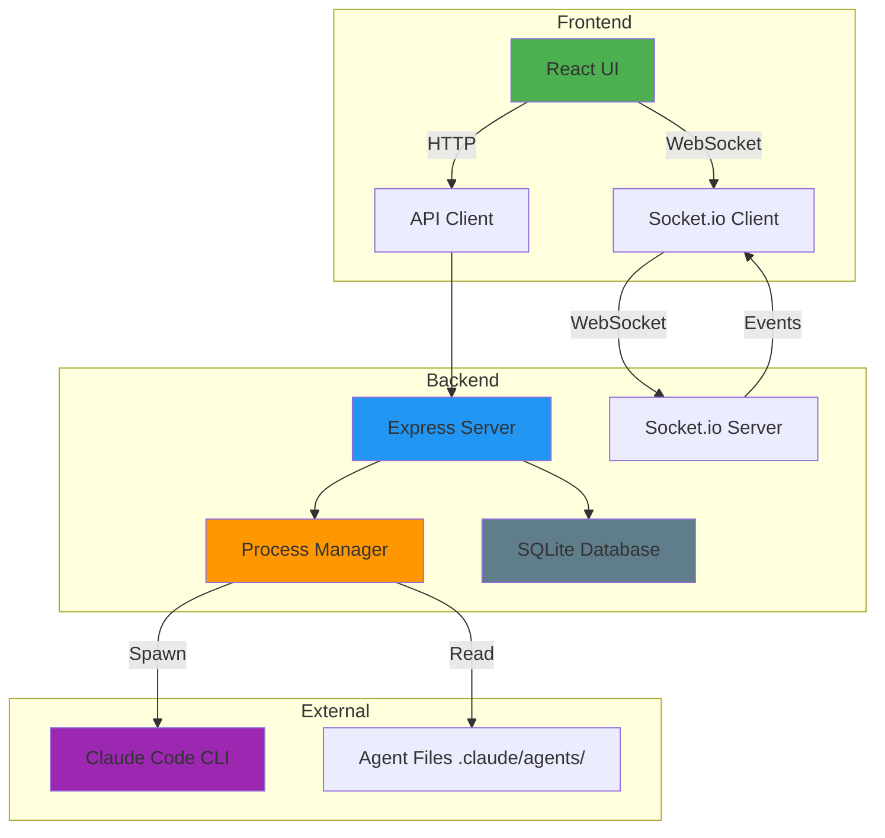

# Home

**Agentic Kanban Board** is a comprehensive session management system designed for developers working with [Claude Code CLI](https://github.com/anthropics/claude-code). It provides an intuitive web interface to manage multiple AI coding sessions simultaneously with advanced features including workflow automation, agent-based prompting, and intelligent project organization.


## 🌟 Overview

Agentic Kanban Board enhances the Claude Code CLI experience by providing:

- **Concurrent Session Management** - Run and manage multiple Claude Code instances simultaneously
- **Real-time WebSocket Communication** - Seamless conversation experience with live updates
- **Agent-Based Workflows** - Dynamic loading of Claude agents for specialized tasks
- **Project Organization** - Group sessions under work items with classification support
- **Visual Kanban Interface** - Intuitive drag-and-drop session management
- **Smart Status Tracking** - Automatic monitoring of session states

## 📋 Table of Contents

- [Quick Start](#quick-start)
- [Key Features](#key-features)
- [Architecture](#architecture)
- [System Requirements](#system-requirements)
- [Project Status](#project-status)
- [Contributing](#contributing)
- [License](#license)

## 🚀 Quick Start

### Prerequisites

- **Operating System**: Windows 10/11 (recommended), Linux, macOS
- **Node.js**: Version 18.0.0 or higher
- **Claude Code CLI**: Latest version installed globally
  ```bash
  npm install -g @anthropic-ai/claude-code
  ```

### Installation

1. **Clone the Repository**
   ```bash
   git clone https://github.com/calebrosario/agentic-kanban-board.git
   cd agentic-kanban-board
   ```

2. **Install Dependencies**
   ```bash
   # Install root dependencies
   npm install

   # Install backend dependencies
   cd backend && npm install

   # Install frontend dependencies
   cd ../frontend && npm install
   ```

3. **Configure Environment**
   ```bash
   # Copy environment example file
   cp .env.example backend/.env

   # Edit backend/.env with your settings
   # Set ADMIN_USERNAME, ADMIN_PASSWORD, and JWT_SECRET
   ```

4. **Start the Application**
   ```bash
   # Option 1: Use provided batch script (Windows)
   start.bat

   # Option 2: Manual startup
   npm run dev:backend   # Terminal 1
   npm run dev:frontend  # Terminal 2
   ```

5. **Access the Application**
   - Frontend: `http://localhost:5173`
   - Backend API: `http://localhost:3001`

## ✨ Key Features

### Session Management
- **Multi-Session Support** - Run and manage multiple Claude Code instances concurrently
- **Real-time Chat Interface** - WebSocket-powered seamless conversation experience
- **Smart Status Tracking** - Automatic monitoring of session states (idle, processing, completed, error)
- **Session Recovery** - Resume previous conversations with full context preservation
- **Quick Session Launch** - Create new sessions based on existing ones with intelligent prefilling

### AI Workflow
- **Agent Integration** - Dynamic loading of Claude agents from `.claude/agents` directory
- **Workflow Stages** - Pre-configured development stages (code review, debugging, feature development)
- **Smart Message Enhancement** - Automatic agent instruction injection for consistent behavior
- **Custom Prompt Templates** - Quick-start templates for common development tasks

### Project Organization
- **Work Items** - Organize sessions under project-specific work items
- **Project Classification** - Tag and categorize sessions with projects and topics
- **Workspace Path Integration** - Automatic working directory management
- **Development Context** - Integration with dev.md and project documentation

### Modern UI/UX
- **Responsive Layout** - Optimized for desktop and tablet viewing
- **Real-time Notifications** - Windows Toast notifications for session events
- **Message Filtering** - Advanced filtering system for different message types
- **Internationalization** - Support for 6 languages: English, Chinese (Simplified/Traditional), Spanish, Japanese, Portuguese

## 🏗️ Architecture

### Tech Stack

#### Backend
- **Runtime**: Node.js 18+
- **Framework**: Express.js
- **Database**: SQLite with Knex.js ORM
- **Real-time**: Socket.io for WebSocket communication
- **Authentication**: JWT-based authentication
- **Process Management**: Child process spawning for Claude Code CLI
- **Logging**: Winston for structured logging

#### Frontend
- **Framework**: React 19 with TypeScript
- **Build Tool**: Vite
- **Routing**: React Router DOM v7
- **State Management**: Zustand for client state
- **Styling**: Tailwind CSS with custom components
- **UI Components**: Material-UI, Radix UI primitives
- **Real-time**: Socket.io-client for WebSocket
- **Internationalization**: i18next with react-i18next
- **Markdown**: react-markdown with syntax highlighting

### Project Structure

```
Agentic-Kanban-Board/
├── backend/                 # Backend API server
│   ├── src/
│   │   ├── config/         # Configuration files
│   │   ├── controllers/    # Route controllers
│   │   ├── database/       # Database schema and migrations
│   │   ├── middleware/     # Express middleware
│   │   ├── repositories/   # Data access layer
│   │   ├── routes/         # API route definitions
│   │   ├── services/       # Business logic
│   │   ├── types/          # TypeScript type definitions
│   │   └── utils/          # Utility functions
│   └── package.json
├── frontend/               # React frontend application
│   ├── src/
│   │   ├── components/     # Reusable React components
│   │   │   ├── Auth/      # Authentication components
│   │   │   ├── Common/    # Shared UI components
│   │   │   ├── Layout/    # Layout components
│   │   │   ├── Session/   # Session-related components
│   │   │   ├── WorkItem/  # Work item components
│   │   │   └── ...
│   │   ├── contexts/       # React contexts
│   │   ├── hooks/         # Custom React hooks
│   │   ├── i18n/          # Internationalization files
│   │   ├── pages/         # Page components
│   │   ├── services/      # API services
│   │   ├── stores/        # Zustand stores
│   │   ├── types/         # TypeScript types
│   │   └── utils/         # Utility functions
│   └── package.json
├── docs/                  # Documentation
├── assets/                # Static assets
├── .env.example          # Environment variables template
├── package.json          # Root package.json
├── README.md             # Main README
└── LICENSE               # MIT License
```

### System Architecture



## ⚙️ System Requirements

### Minimum Requirements
- **CPU**: Dual-core processor
- **RAM**: 4GB minimum (8GB recommended)
- **Disk Space**: 500MB free space
- **Network**: Internet connection for Claude API access

### Recommended Requirements
- **CPU**: Quad-core processor or higher
- **RAM**: 8GB or more
- **Disk Space**: 1GB free space
- **Network**: Stable broadband connection

## 📊 Project Status

**Notice**: This project is maintained in an archival state. The repository is no longer actively updated.

**Maintenance**: No
**License**: MIT
**Platform**: Windows 10/11 (primary), Linux, macOS

### Completed Features
- ✅ Session management with real-time updates
- ✅ Agent-based workflow integration
- ✅ Work item organization
- ✅ WebSocket communication
- ✅ Authentication system
- ✅ Internationalization (6 languages)
- ✅ SQLite database with migrations
- ✅ Process monitoring and notifications

### Known Limitations
- ⚠️ Security: Not designed for online deployment (see [Security](Security))
- ⚠️ Platform: Primarily designed for Windows
- ⚠️ Active Development: Project is in maintenance mode

## 🤝 Contributing

This project is currently in maintenance mode and not actively accepting new features. However, bug fixes and documentation improvements are welcome.

### Development Workflow

1. Fork the repository
2. Create a feature branch from `master`
3. Make your changes
4. Commit with clear messages
5. Push to your fork
6. Submit a pull request

### Code Style
- TypeScript for type safety
- ESLint for code quality
- Conventional Commits for commit messages
- Git worktrees for multi-agent development

## 📝 License

This project is licensed under the MIT License - see the [LICENSE](../LICENSE) file for details.

**Important**: The authors and contributors accept NO RESPONSIBILITY for any damages, losses, or security breaches that may occur from using this software. See the [Disclaimer](Disclaimer) for more information.

## 📚 Additional Resources

- [Installation Guide](Installation)
- [Usage Guide](Usage)
- [API Documentation](API-Documentation)
- [Configuration](Configuration)
- [Security](Security)
- [Troubleshooting](Troubleshooting)
- [Architecture Deep Dive](Architecture-Deep-Dive)

## 🆘 Support

- 📚 **Documentation**: Check this wiki and inline code documentation
- 🐛 **Bug Reports**: Open an issue on GitHub
- 💡 **Feature Requests**: Discuss in GitHub Discussions

---

**Built with ❤️ for developers who love AI-powered coding**

[⭐ Star this repo](https://github.com/calebrosario/agentic-kanban-board) • [🐛 Report Bug](https://github.com/calebrosario/agentic-kanban-board/issues) • [💡 Request Feature](https://github.com/calebrosario/agentic-kanban-board/issues)
