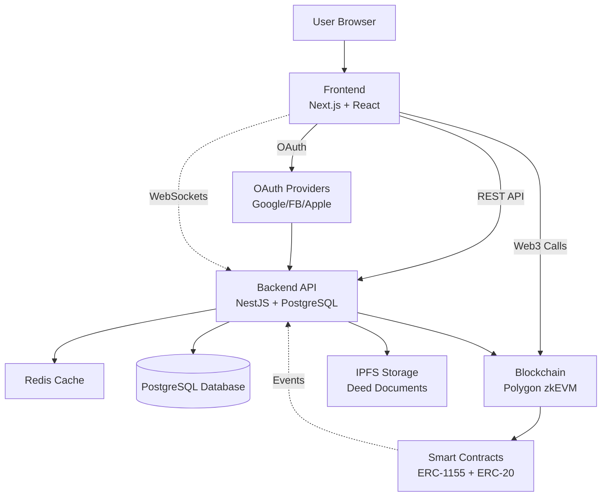
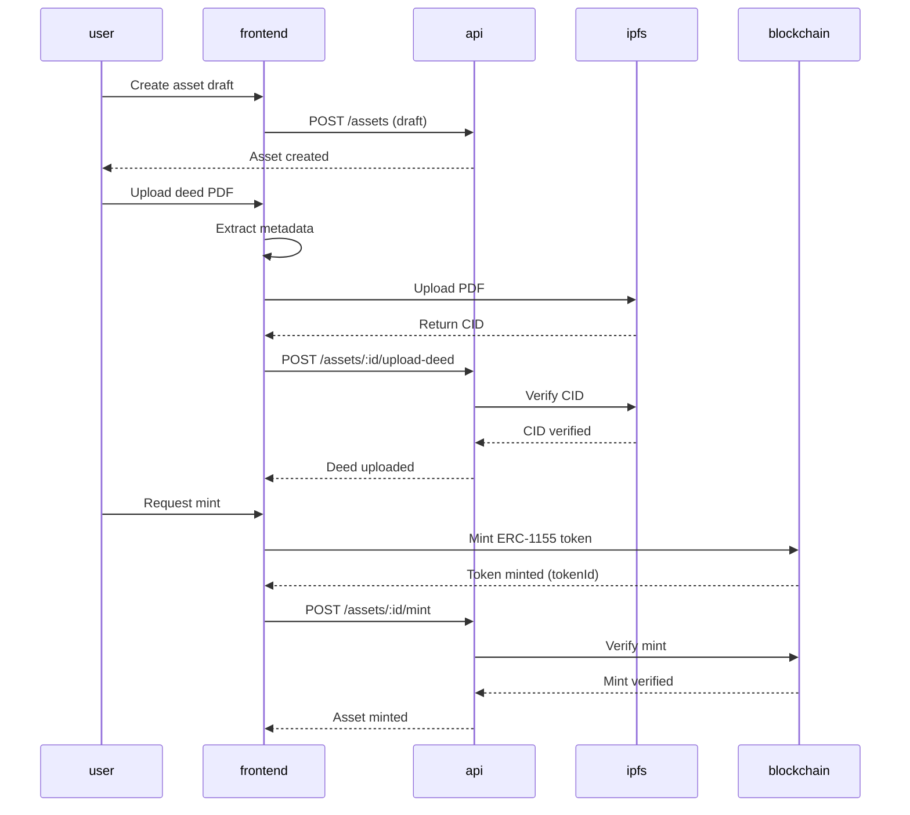
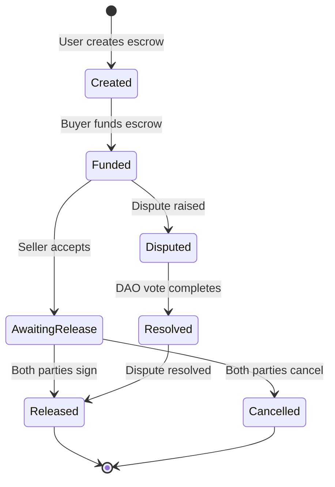
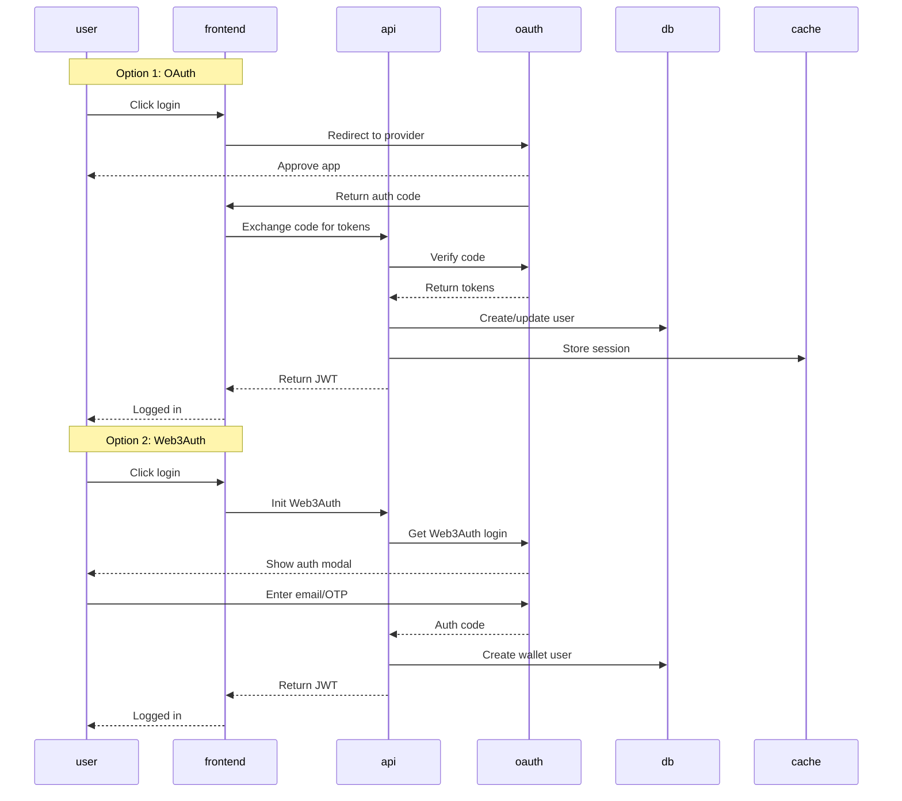
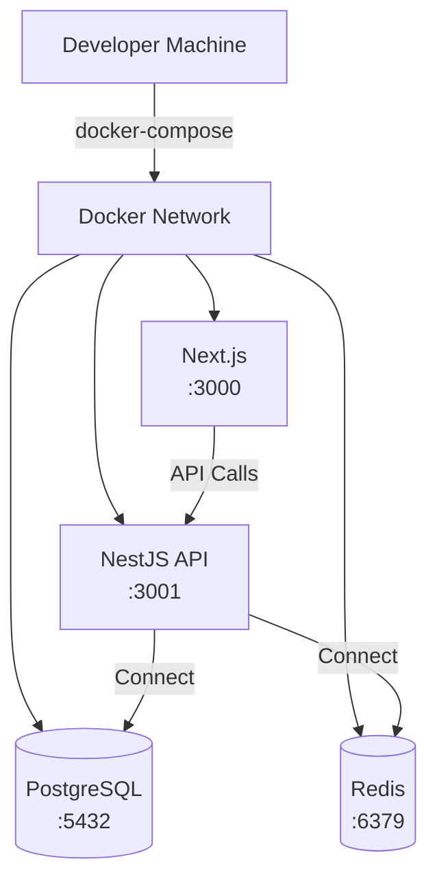
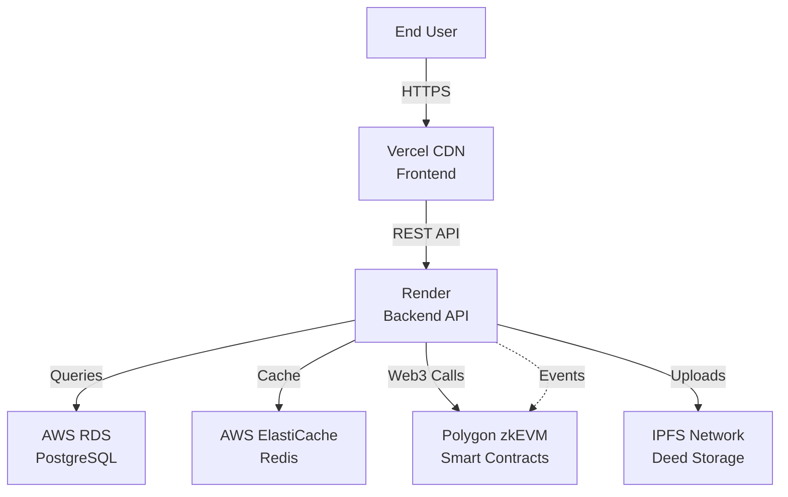
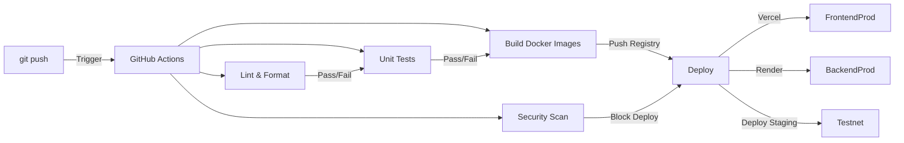

# Architecture Deep Dive: Digital Asset Management Platform

This document provides a comprehensive technical deep dive into the system architecture, data flows, and component interactions.

## Table of Contents

- [System Overview](#system-overview)
- [Technology Stack](#technology-stack)
- [Component Architecture](#component-architecture)
- [Data Flows](#data-flows)
- [Deployment Architecture](#deployment-architecture)
- [State Management](#state-management)
- [Security Architecture](#security-architecture)
- [Scalability Considerations](#scalability-considerations)

---

## System Overview

The Digital Asset Management Platform is a full-stack application for tokenizing real estate assets on the Polygon blockchain.

### High-Level Architecture



### Three-Tier Architecture

```
┌─────────────────────────────────────────────────────────────┐
│                    PRESENTATION LAYER                    │
│  ┌─────────────────────────────────────────────────┐    │
│  │         Next.js + React                   │    │
│  │         - User Interface                   │    │
│  │         - State Management                 │    │
│  │         - Wallet Integration               │    │
│  │         - Real-time Updates               │    │
│  └─────────────────────────────────────────────────┘    │
└──────────────────────────────────────┬──────────────────────┘
                               │
                               ▼
┌─────────────────────────────────────────────────────────────┐
│                   APPLICATION LAYER                     │
│  ┌─────────────────────────────────────────────────┐    │
│  │         NestJS + TypeORM                   │    │
│  │         - REST API Endpoints               │    │
│  │         - Authentication                    │    │
│  │         - Authorization                    │    │
│  │         - Business Logic                    │    │
│  │         - Event Listeners                   │    │
│  └─────────────────────────────────────────────────┘    │
└──────────────────────────────────────┬──────────────────────┘
                               │
                               ▼
┌─────────────────────────────────────────────────────────────┐
│                    DATA LAYER                             │
│  ┌──────────────┬─────────────────────┬─────────────┐    │
│  │ PostgreSQL   │   Redis Cache     │   IPFS      │    │
│  │             │                   │             │    │
│  │ - User DB   │   - Session Store   │   - Deed    │    │
│  │ - Asset DB  │   - Query Cache    │   - Meta    │    │
│  │ - Escrow DB │                   │   - Docs    │    │
│  └──────────────┴─────────────────────┴─────────────┘    │
└─────────────────────────────────────────────────────────────┘
```

---

## Technology Stack

### Frontend Stack

| Component | Technology | Version | Purpose |
|-----------|-----------|---------|---------|
| Framework | Next.js | 15.1.4 | React framework with App Router |
| UI Library | React | 18.2.0 | Component library |
| Styling | Tailwind CSS | 3.4.19 | Utility-first CSS |
| State Management | TanStack Query | 5.59.16 | Server state and mutations |
| Web3 Integration | Wagmi | 2.12.17 | Ethereum wallet hooks |
| Web3 Integration | Viem | 2.21.6 | Ethereum utilities |
| Wallet Auth | Web3Auth | 9.7.0 | Custodial wallet solution |
| OAuth | react-google-login | 5.2.2 | Google authentication |
| OAuth | react-facebook-login | 4.1.1 | Facebook authentication |
| Error Tracking | Sentry | 8.0.0 | Client error monitoring |

### Backend Stack

| Component | Technology | Version | Purpose |
|-----------|-----------|---------|---------|
| Framework | NestJS | 10.0.0 | Node.js framework |
| Database | PostgreSQL | 8.16.3 | Relational database |
| ORM | TypeORM | 0.3.20 | Database abstraction |
| Cache | Redis | 6+ | Query and session cache |
| Auth | Passport | 0.7.0 | Authentication middleware |
| JWT | jsonwebtoken | 9.0.2 | Token-based auth |
| File Upload | PDF-parse | 2.4.5 | PDF metadata extraction |
| IPFS Client | ipfs-http-client | 60.0.1 | Decentralized storage |
| Web3 | ethers.js | 6.15.0 | Blockchain interaction |
| Error Tracking | Sentry | 8.0.0 | Server error monitoring |

### Blockchain Stack

| Component | Technology | Version | Purpose |
|-----------|-----------|---------|---------|
| Framework | Hardhat | 2.19.0 | Smart contract development |
| Testing | Foundry | latest | Fast contract testing |
| Contracts | OpenZeppelin | 5.0.0 | Audited contract library |
| Network | Polygon zkEVM | - | Layer 2 scaling solution |
| Token Standards | ERC-1155, ERC-20 | - | Multi-token and fractional ownership |

### DevOps Stack

| Component | Technology | Purpose |
|-----------|-----------|---------|
| CI/CD | GitHub Actions | Automated workflows |
| Containerization | Docker | Application packaging |
| Orchestration | Docker Compose | Local development |
| Deployment | Vercel (Frontend), Render (Backend) | Production hosting |
| Monitoring | Sentry | Error tracking and performance |
| Secrets | GitHub Secrets | Secure configuration management |

---

## Component Architecture

### Frontend Components

```
frontend/src/
├── app/                              # Next.js App Router
│   ├── (auth)/                       # Auth routes
│   │   ├── login/page.tsx            # OAuth login
│   │   ├── register/page.tsx          # User registration
│   │   ├── auth/page.tsx             # Web3Auth
│   │   └── callback/page.tsx         # OAuth callbacks
│   ├── (dashboard)/                   # Dashboard layout
│   │   └── page.tsx                # Main dashboard
│   ├── assets/                         # Asset routes
│   │   └── [id]/page.tsx           # Asset detail
│   ├── escrows/                        # Escrow routes
│   │   ├── create/page.tsx           # Create escrow
│   │   └── [id]/page.tsx            # Escrow detail
│   ├── profile/page.tsx                # User profile
│   ├── layout.tsx                     # Root layout wrapper
│   └── page.tsx                      # Home page
│
├── components/                       # Reusable components
│   ├── Layout.tsx                   # Page wrapper
│   ├── Sidebar.tsx                   # Navigation sidebar
│   ├── Navbar.tsx                    # Top navigation
│   ├── AssetCreationForm.tsx         # Asset form
│   ├── DeedUpload.tsx                # File upload
│   ├── AccessibleButton.tsx          # A11y button wrapper
│   ├── AccessibleLink.tsx            # A11y link wrapper
│   ├── SkipLink.tsx                  # Skip to content
│   ├── Loading.tsx                    # Loading spinner
│   └── ErrorBoundary.tsx             # Error boundary
│
├── hooks/                           # Custom React hooks
│   ├── useAuth.ts                    # Auth state management
│   ├── useWallet.ts                  # Wallet connection
│   ├── useMint.ts                    # Minting logic
│   ├── useCustodialMint.ts           # Custodial minting
│   └── useCustodialAuth.ts           # Web3Auth integration
│
├── lib/                             # Utilities and clients
│   ├── api.ts                       # API client
│   ├── clients/
│   │   └── wagmi.ts               # Wagmi configuration
│   ├── constants.ts                   # Route constants
│   └── directus.ts                   # CMS schemas
│
└── types/                           # TypeScript definitions
    ├── index.ts                      # Core types
    └── web3.d.ts                     # Web3 types
```

### Backend Components

```
api/src/
├── auth/                             # Authentication & authorization
│   ├── auth.controller.ts              # Login/register endpoints
│   ├── auth.service.ts                # Auth logic
│   ├── strategies/                     # Passport strategies
│   │   ├── google.strategy.ts           # Google OAuth
│   │   ├── facebook.strategy.ts        # Facebook OAuth
│   │   ├── apple.strategy.ts           # Apple OAuth
│   │   ├── jwt.strategy.ts            # JWT validation
│   │   └── web3auth.strategy.ts      # Web3Auth integration
│   ├── guards/                        # Route guards
│   │   ├── jwt-auth.guard.ts          # JWT validation
│   │   └── roles.guard.ts            # Role-based access
│   └── decorators/                    # Custom decorators
│       ├── @roles.decorator.ts         # Role checking
│       └── @public.decorator.ts        # Public route marker
│
├── assets/                           # Asset management
│   ├── assets.controller.ts           # Asset CRUD endpoints
│   ├── assets.service.ts            # Asset business logic
│   ├── entities/                    # TypeORM entities
│   │   └── asset.entity.ts          # Asset DB model
│   └── dto/                        # Data transfer objects
│       ├── create-asset.dto.ts       # Create validation
│       └── update-asset.dto.ts       # Update validation
│
├── escrows/                          # Escrow logic
│   ├── escrows.controller.ts        # Escrow CRUD endpoints
│   ├── escrows.service.ts          # Escrow business logic
│   ├── entities/
│   │   └── escrow.entity.ts        # Escrow DB model
│   └── dto/
│       ├── create-escrow.dto.ts      # Create validation
│       └── update-escrow.dto.ts      # Update validation
│
├── users/                            # User management
│   ├── users.controller.ts           # User CRUD endpoints
│   ├── users.service.ts            # User business logic
│   └── entities/
│       └── user.entity.ts            # User DB model
│
├── common/                           # Shared utilities
│   ├── filters/                      # Exception filters
│   │   └── http-exception.filter.ts # Global error handler
│   ├── interceptors/                 # HTTP interceptors
│   │   ├── logging.interceptor.ts   # Request logging
│   │   └── transform.interceptor.ts # Response transformation
│   └── decorators/                  # Custom decorators
│
└── main.ts                           # Application entry point
    - Module imports
    - Middleware configuration
    - Global exception handling
    - Swagger setup
```

### Blockchain Components

```
blockchain/contracts/
├── KYCVerifier.sol                  # KYC access control
├── AssetToken.sol                   # ERC-1155 multi-token
│   ├── AssetTokenImplementation       # Core token logic
│   └── AssetTokenProxy            # Upgradeable proxy
├── ShareToken.sol                   # ERC-20 fractional token
│   ├── ShareTokenImplementation      # Core token logic
│   └── ShareTokenProxy             # Upgradeable proxy
├── Escrow.sol                        # Escrow state machine
│   ├── EscrowImplementation          # Core escrow logic
│   └── EscrowProxy               # Upgradeable proxy
├── TimelockController.sol           # Time-based execution
├── Governor.sol                       # DAO governance
└── interfaces/
    ├── IAssetToken.sol              # Asset token interface
    ├── IShareToken.sol              # Share token interface
    └── IEscrow.sol                  # Escrow interface
```

---

## Data Flows

### Asset Tokenization Flow



### Escrow Flow



### Authentication Flow



---

## Deployment Architecture

### Development Environment



### Production Environment



### CI/CD Pipeline



---

## State Management

### Frontend State

**Server State (TanStack Query):**
- Asset lists (paginated)
- Escrow lists (paginated)
- User profile data
- Real-time updates (cache invalidation)

**Local State (useState/useEffect):**
- Form inputs (asset creation, escrow creation)
- UI states (loading, error, success)
- Modal states (open/close)
- Wallet connection status

**Global State:**
- Authentication status (localStorage + useAuth hook)
- Wallet connection (useWallet hook)
- User session (JWT token in localStorage)

### Backend State

**Database State:**
- User records (persistent)
- Asset records (persistent)
- Escrow records (persistent)
- KYC verification status (persistent)

**Cache State:**
- Query results (TTL: 5 minutes)
- Session data (TTL: 24 hours)
- Frequent lookups (TTL: 1 hour)

**Blockchain State:**
- Token ownership (immutable, on-chain)
- Escrow state (state machine, on-chain)
- Governance votes (immutable, on-chain)
- DAO proposals (immutable, on-chain)

---

## Security Architecture

### Authentication Layers

```
┌─────────────────────────────────────────────────────────┐
│            Multi-Layer Authentication              │
│                                                   │
│  ┌──────────────────────────────────────────┐        │
│  │ 1. Session Management (JWT)         │        │
│  │ 2. OAuth Provider Validation         │        │
│  │ 3. Role-Based Access Control        │        │
│  │ 4. KYC Verification Integration    │        │
│  └──────────────────────────────────────────┘        │
└─────────────────────────────────────────────────────────┘
```

### Authorization Model

**Role-Based Access Control (RBAC):**
- **USER**: Standard user permissions
- **ADMIN**: Full system access
- **KYC_VERIFIED**: Can mint assets
- **VERIFIER**: Can approve KYC requests

**Smart Contract Roles:**
- **DEFAULT_ADMIN_ROLE**: Initial deployer
- **MINTER_ROLE**: Can mint tokens
- **PAUSER_ROLE**: Can pause contracts
- **KYC_ADMIN_ROLE**: Can verify KYC

### Data Security

**Encryption:**
- TLS 1.3 for all external communications
- JWT tokens for API authentication (256-bit secret)
- bcrypt for password hashing (10 rounds)

**Data Protection:**
- Environment variables for secrets (never in code)
- GitHub Secrets for CI/CD
- IPFS for immutable deed storage
- Encrypted database connections

**Audit Trail:**
- All asset changes logged (database)
- All escrow state changes logged (blockchain events)
- All admin actions logged (audit log)

---

## Scalability Considerations

### Database Scaling

**Read Replicas:**
- Multiple read replicas for high availability
- Connection pooling (TypeORM)
- Query optimization (indexes)

**Write Scaling:**
- Single primary database
- Write queuing for high load
- Connection limits and timeouts

### Application Scaling

**Frontend:**
- Vercel edge deployment (global CDN)
- Static asset optimization
- Code splitting and lazy loading

**Backend:**
- Render horizontal scaling (container instances)
- Redis for distributed caching
- WebSocket support for real-time updates

**Blockchain:**
- Layer 2 scaling (Polygon zkEVM)
- Gas optimization (batch operations)
- Event log indexing for fast queries

### Bottleneck Analysis

**Current Limitations:**
- Single database instance (no read replicas)
- No message queue (direct API calls)
- Sequential blockchain operations

**Scaling Path:**
1. Add read replicas for database
2. Implement message queue (BullMQ)
3. Optimize smart contract gas usage
4. Add caching layer for frequent queries

---

## Key Design Decisions

### Why NestJS for Backend?

**Decision**: Use NestJS framework

**Rationale**:
- Built-in dependency injection
- Type-safe with TypeScript
- Modular architecture
- Active community and ecosystem
- Easy testing with Jest integration

### Why Next.js for Frontend?

**Decision**: Use Next.js with App Router

**Rationale**:
- Server-side rendering (SSR) for performance
- Built-in routing and optimization
- API routes for backend-for-fronted
- Image optimization
- Vercel integration

### Why Polygon zkEVM?

**Decision**: Use Polygon zkEVM for smart contracts

**Rationale**:
- Low transaction fees
- EVM compatibility (easy migration)
- High throughput
- Strong tooling support
- Growing ecosystem

### Why TypeORM?

**Decision**: Use TypeORM for database

**Rationale**:
- TypeScript-native (type-safe queries)
- Active development
- Supports multiple databases
- Migration system built-in
- Easy to test

---

## Migration Paths

### Current to Monorepo

Current: Separate frontend, backend, blockchain directories

Migration Path:
1. Create monorepo root with `npm workspaces`
2. Shared dependencies in root
3. Shared TypeScript configuration
4. Lerna or Turbo for build orchestration

### Current to Microservices

Current: Monolithic NestJS backend

Migration Path:
1. Extract auth service to microservice
2. Extract asset service to microservice
3. API Gateway for routing
4. Shared event bus (Kafka/RabbitMQ)

---

## Related Documentation

- [README.md](../README.md) - Project overview
- [docs/03-architecture-overview.md](03-architecture-overview.md) - High-level architecture
- [docs/BLOCKCHAIN.md](BLOCKCHAIN.md) - Smart contract details
- [docs/API.md](API.md) - API reference
- [docs/02-setup-and-installation.md](02-setup-and-installation.md) - Setup guide

---

**Last Updated**: 2026-02-03
**Maintainer**: Architecture Team
