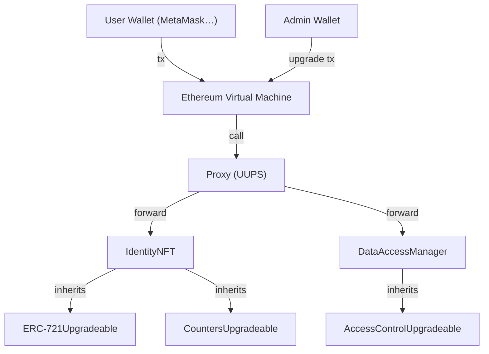
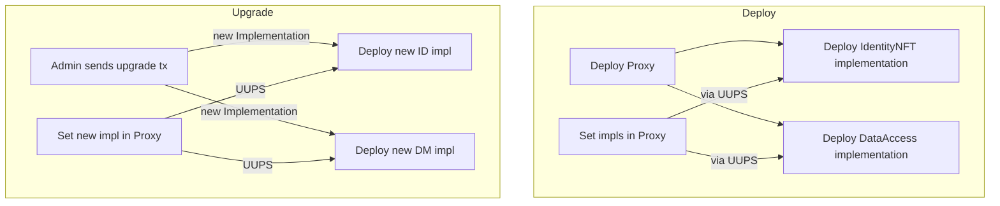

## 1️⃣ Architecture Diagram

### What each component does

| Symbol | Role |
|--------|------|
| **User Wallet** | Any user (owner or borrower) that holds an NFT. |
| **Admin Wallet** | Address that holds `DEFAULT_ADMIN_ROLE` / `UPGRADER_ROLE` and can perform upgrades. |
| **Proxy** | The single on‑chain address that forwards all calls to the current implementation (IdentityNFT or DataAccessManager). |
| **IdentityNFT** | ERC‑721 contract that mints immutable identity tokens (`isOwner` / `isBorrower`). |
| **DataAccessManager** | Stores owner data and handles request/approval/revoke logic. |
| **Utilities** | OpenZeppelin upgradeable libraries that the two main contracts inherit from. |
| **EVM** | The underlying blockchain where everything runs. |

---

## Optional: Deploy‑and‑Upgrade Flow

* **Deploy phase** – only the admin deploys the proxy and implementation contracts, then points the proxy to the
implementations.
* **Upgrade phase** – the admin deploys a *new* implementation and uses the proxy’s `upgradeTo` function
(protected by `UPGRADER_ROLE`).

---

### Bottom‑line

* **IdentityNFT** is the *identity* layer (owner/borrower flag).
* **DataAccessManager** is the *data‑access* layer, keeping data and permissions off‑chain (the data is just a
URI/hash).
* **UUPS Proxy** guarantees the whole system can be upgraded without changing the user‑facing address.
* The **flow‑chart** describes the exact sequence of transactions a user would run through a wallet, ensuring
clarity for developers and auditors alike.

### Key Points

| Feature | How it works |
|---------|--------------|
| **Fee per token** | Stored in `IdentityNFT.borrowFee[tokenId]`. |
| **Fee token** | `IdentityNFT.feeToken` may be zero (native ETH) or an ERC‑20 address. |
| **Paying the fee** | In `DataAccessManager.requestAccess` we use `SafeERC20` to pull the fee from the borrower to the data‑owner. |
| **Reentrancy protection** | `nonReentrant` on `requestAccess` prevents a malicious borrower from re‑entering before the state change. |
| **Upgradability** | Both contracts are UUPS‑upgradeable with a dedicated `UPGRADER_ROLE`. |

---

> **Notice the new “pay fee” step** – the borrower’s transaction includes the `value` (or ERC‑20 transfer) that matches the fee set by the owner.

---

## 4️⃣ Quick Checklist Before Deploying

1. **Test the fee flow**
   - Mint an owner token, set a fee, mint a borrower token, and request access while sending the exact fee (ETH or ERC‑20).
   - Verify that the fee lands in the owner’s balance.

2. **Verify access logic**
   - Ensure `getData` only succeeds when `accessAllowed[borrower][owner]` is `true`.
   - Test revocation and re‑approval.

3. **Upgrade safety**
   - Deploy a dummy contract that implements the same interfaces and call `_authorizeUpgrade` from an admin to confirm the UUPS upgrade works.

4. **Reentrancy guard**
   - The `nonReentrant` modifier on `requestAccess` protects against a malicious borrower who could re‑enter before the state change is complete.

5. **Front‑end integration**
   - Expose the `borrowFee` mapping to the UI so users see the cost before they request access.

---

### TL;DR

- **IdentityNFT** now lets a token owner set a borrowing fee (ETH or ERC‑20).
- **DataAccessManager** pulls that fee from the borrower during `requestAccess`.
- All functions are upgrade‑safe (UUPS) and guarded against reentrancy.
- The flow diagram has been updated to include the payment step.

