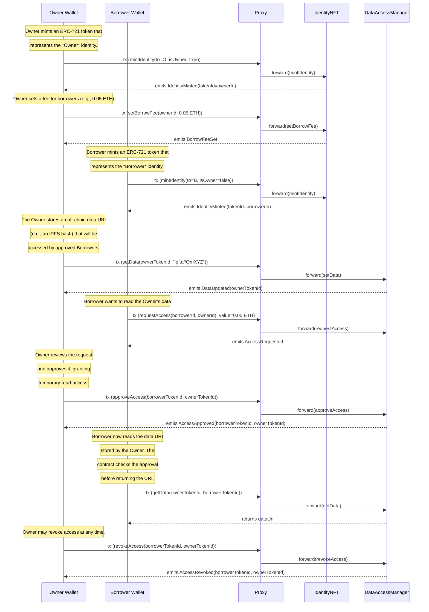

## Flow‑Chart (sequence of actions)

Below is a **complete, ready‑to‑paste Mermaid sequence diagram** that shows the full lifecycle of an IdentityNFT
and DataAccessManager interaction for **two distinct wallets** – one holding the *Owner* token and the other
holding the *Borrower* token.

### How to use this diagram

1. **Copy** the block above.
2. **Paste** it into any Markdown/mermaid‑enabled editor (GitHub README, VS Code preview, Typora, etc.).
3. The diagram will render a linear sequence of steps that involve **two distinct wallet actors**—`Owner Wallet`
and `Borrower Wallet`.

### Quick recap of the interactions

| Step | Owner | Borrower | Proxy | IdentityNFT | DataAccessManager |
|------|-------|----------|-------|-------------|-------------------|
| 1 | mints Owner NFT | – | forwards | mints | – |
| 2 | sets a borrowing fee | – | forwards | set fee | – |
| 3 | – | mints Borrower NFT | forwards | mints | – |
| 4 | sets data | – | forwards | – | updates data |
| 5 | – | requests access | forwards | – | logs request |
| 6 | approves request | – | forwards | – | logs approval |
| 7 | – | reads data | forwards | – | returns data |
| 8 | revokes access | – | forwards | – | logs revocation |

### Step‑by‑step

| Step | Actors | Action | Event |
|------|--------|--------|-------|
| **1** | User (Owner) | `mintIdentity(ownerNFT, true)` | `IdentityMinted` |
| **2** | User (Owner) | `setBorrowFee(ownerTokenId, fee)` | `BorrowFeeSet` |
| **3** | User (Borrower) | `mintIdentity(borrowerNFT, false)` | `IdentityMinted` |
| **4** | Owner | `setData(ownerTokenId, dataURI)` | `DataUpdated` |
| **5** | Borrower | `requestAccess(borrowerTokenId, ownerTokenId)` | `AccessRequested` |
| **5a** | Borrower | `requestAccess(borrowerTokenId, ownerTokenId)` with fee | `AccessRequested` & `AccessApproved` |
| **6** | Owner | `approveAccess(borrowerTokenId, ownerTokenId)` | `AccessApproved` |
| **7** | Borrower | `getData(ownerTokenId, borrowerTokenId)` | returns data |
| **8** | Owner | `revokeAccess(borrowerTokenId, ownerTokenId)` | `AccessRevoked` |

> The diagram shows **Proxy → Contract** forwarding.  Each external transaction is sent by a wallet; the proxy
forwards to the implementation that actually executes the logic.

---
