# State Machine Diagram - Health-Mesh Medical Research Platform

**Version**: 1.0  
**Date**: January 20, 2026  
**Status**: All systems integrated with Epic FHIR

---

## System Overview

The Health-Mesh platform consists of 9 major interconnected systems:

1. **Patient Portal** - Patient-facing frontend for data control and monetization
2. **Epic FHIR Integration** - Secure EHR system connection via SMART on FHIR
3. **BullMQ Queue System** - Asynchronous job processing and data sync
4. **Neo4j Graph Database** - Patient relationship and analytics graph
5. **Data Quality Service** - FHIR data validation and PHI masking
6. **Compliance Service** - HIPAA/GDPR/CCPA regulatory enforcement
7. **Researcher Portal** - Researcher-facing data marketplace
8. **Provider Portal** - Provider-facing access request system
9. **Blockchain Layer** - Immutable consent and access control via smart contracts

---

## State Machine Diagram

```mermaid
stateDiagram-v2
    [*] --> PatientPortal
    
    state PatientPortal {
        [*] --> PatientPortal.Initial
        PatientPortal.Initial --> PatientPortal.LoggedIn
        PatientPortal.LoggedIn --> PatientPortal.EpicAuthorized
        PatientPortal.LoggedIn --> PatientPortal.DataViewing
        PatientPortal.DataViewing --> PatientPortal.ConsentManagement
        PatientPortal.ConsentManagement --> PatientPortal.LoggedIn
        PatientPortal.EpicAuthorized --> PatientPortal.DataSyncing
        PatientPortal.DataSyncing --> PatientPortal.LoggedIn
        PatientPortal.LoggedIn --> PatientPortal.Initial
    }
    
    [*] --> EpicFHIR
    
    state EpicFHIR {
        [*] --> EpicFHIR.Idle
        EpicFHIR.Idle --> EpicFHIR.Authorizing
        EpicFHIR.Authorizing --> EpicFHIR.TokenExchange
        EpicFHIR.TokenExchange --> EpicFHIR.Syncing
        EpicFHIR.Syncing --> EpicFHIR.Idle
        EpicFHIR.Syncing --> EpicFHIR.Error
        EpicFHIR.Error --> EpicFHIR.TokenExchange
        EpicFHIR.Idle --> EpicFHIR.Disconnected
        EpicFHIR.Disconnected --> EpicFHIR.Idle
    }
    
    [*] --> BullMQ
    
    state BullMQ {
        [*] --> BullMQ.Waiting
        BullMQ.Waiting --> BullMQ.Active
        BullMQ.Active --> BullMQ.Completed
        BullMQ.Active --> BullMQ.Failed
        BullMQ.Active --> BullMQ.Delayed
        BullMQ.Failed --> BullMQ.Waiting
        BullMQ.Delayed --> BullMQ.Active
        BullMQ.Completed --> [*]
    }
    
    [*] --> Neo4j
    
    state Neo4j {
        [*] --> Neo4j.Disconnected
        Neo4j.Disconnected --> Neo4j.Connected
        Neo4j.Connected --> Neo4j.Querying
        Neo4j.Connected --> Neo4j.Updating
        Neo4j.Querying --> Neo4j.Connected
        Neo4j.Updating --> Neo4j.Connected
        Neo4j.Querying --> Neo4j.Error
        Neo4j.Updating --> Neo4j.Error
        Neo4j.Error --> Neo4j.Connected
        Neo4j.Connected --> Neo4j.Disconnected
    }
    
    [*] --> DataQuality
    
    state DataQuality {
        [*] --> DataQuality.Idle
        DataQuality.Idle --> DataQuality.Validating
        DataQuality.Validating --> DataQuality.QualityCheck
        DataQuality.QualityCheck --> DataQuality.MaskingPHI
        DataQuality.QualityCheck --> DataQuality.Compliant
        DataQuality.QualityCheck --> DataQuality.NonCompliant
        DataQuality.MaskingPHI --> DataQuality.Compliant
        DataQuality.Compliant --> DataQuality.Idle
        DataQuality.NonCompliant --> DataQuality.Idle
    }
    
    [*] --> Compliance
    
    state Compliance {
        [*] --> Compliance.Idle
        Compliance.Idle --> Compliance.CheckingHIPAA
        Compliance.Idle --> Compliance.CheckingGDPR
        Compliance.Idle --> Compliance.CheckingCCPA
        Compliance.CheckingHIPAA --> Compliance.Compliant
        Compliance.CheckingHIPAA --> Compliance.ViolationDetected
        Compliance.CheckingGDPR --> Compliance.Compliant
        Compliance.CheckingGDPR --> Compliance.ViolationDetected
        Compliance.CheckingCCPA --> Compliance.Compliant
        Compliance.CheckingCCPA --> Compliance.ViolationDetected
        Compliance.ViolationDetected --> Compliance.Idle
        Compliance.Compliant --> Compliance.Idle
    }
    
    [*] --> ResearcherPortal
    
    state ResearcherPortal {
        [*] --> ResearcherPortal.Initial
        ResearcherPortal.Initial --> ResearcherPortal.Authenticated
        ResearcherPortal.Authenticated --> ResearcherPortal.BrowsingMarketplace
        ResearcherPortal.BrowsingMarketplace --> ResearcherPortal.PurchasingAccess
        ResearcherPortal.BrowsingMarketplace --> ResearcherPortal.Authenticated
        ResearcherPortal.PurchasingAccess --> ResearcherPortal.DataAccess
        ResearcherPortal.DataAccess --> ResearcherPortal.Analysis
        ResearcherPortal.Analysis --> ResearcherPortal.Authenticated
        ResearcherPortal.Authenticated --> ResearcherPortal.Initial
    }
    
    [*] --> ProviderPortal
    
    state ProviderPortal {
        [*] --> ProviderPortal.Initial
        ProviderPortal.Initial --> ProviderPortal.Authenticated
        ProviderPortal.Authenticated --> ProviderPortal.RequestingAccess
        ProviderPortal.RequestingAccess --> ProviderPortal.AccessApproved
        ProviderPortal.RequestingAccess --> ProviderPortal.AccessDenied
        ProviderPortal.AccessApproved --> ProviderPortal.AuditView
        ProviderPortal.AccessDenied --> ProviderPortal.Authenticated
        ProviderPortal.AuditView --> ProviderPortal.Authenticated
        ProviderPortal.Authenticated --> ProviderPortal.Initial
    }
    
    [*] --> Blockchain
    
    state Blockchain {
        [*] --> Blockchain.Idle
        Blockchain.Idle --> Blockchain.DeployingContract
        Blockchain.DeployingContract --> Blockchain.MintingNFT
        Blockchain.MintingNFT --> Blockchain.GrantingAccess
        Blockchain.GrantingAccess --> Blockchain.Idle
        Blockchain.GrantingAccess --> Blockchain.RevokingAccess
        Blockchain.RevokingAccess --> Blockchain.Idle
        Blockchain.DeployingContract --> Blockchain.Error
        Blockchain.MintingNFT --> Blockchain.Error
        Blockchain.Error --> Blockchain.Idle
    }
    
    EpicFHIR.Authorizing --> BullMQ.Waiting
    BullMQ.Active --> DataQuality.Validating
    DataQuality.Compliant --> Neo4j.Updating
    Neo4j.Updating --> Compliance.CheckingHIPAA
    Compliance.Compliant --> BullMQ.Completed
    
    PatientPortal.EpicAuthorized --> EpicFHIR.Authorizing
    ResearcherPortal.PurchasingAccess --> Blockchain.GrantingAccess
    ProviderPortal.RequestingAccess --> PatientPortal.ConsentManagement
```

